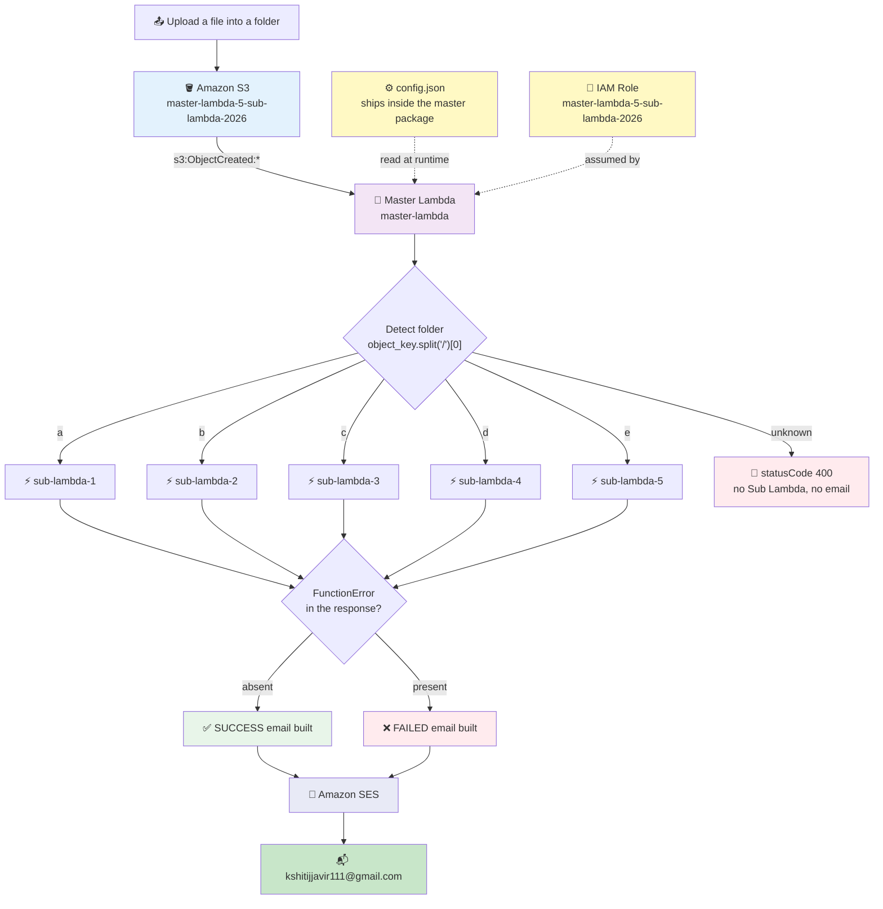
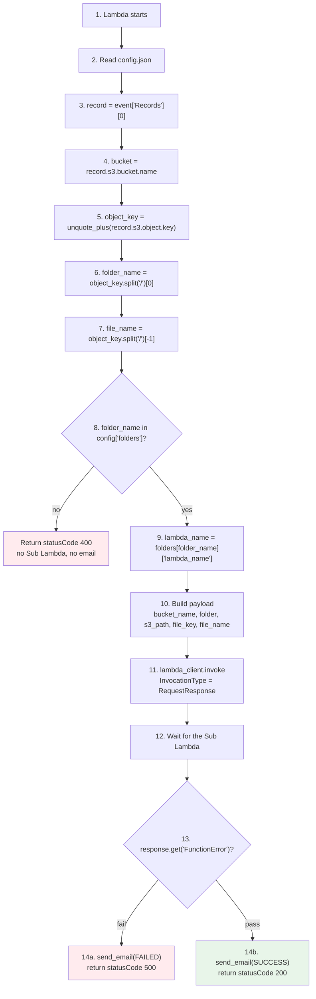
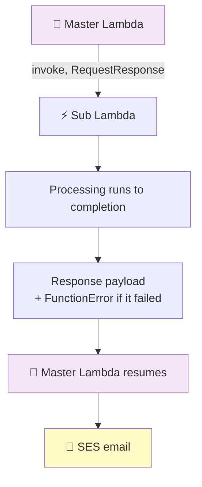
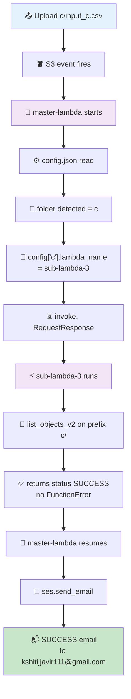
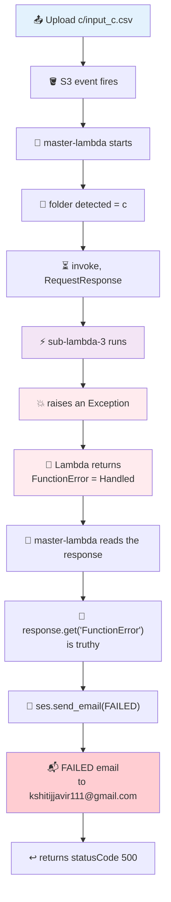
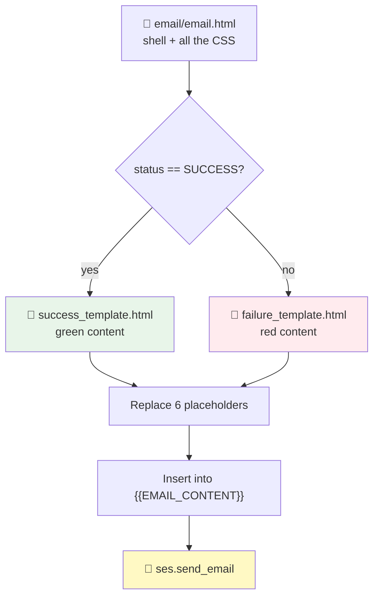
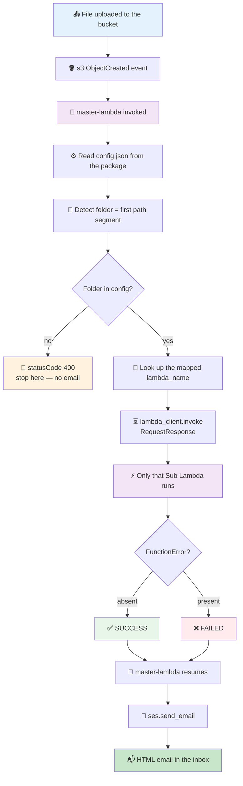

# 20) S3 Folder Based Lambda Processing with Master Lambda, Sub Lambdas and SES Email Notification

## One Master Lambda Routes Each S3 Folder to Its Own Sub Lambda, Waits for the Result, Then Emails It

## 📁 Files in This Folder

| File | What It Is |
| ---- | ---------- |
| [lambda_function.py](lambda_function.py) | The **Master Lambda** handler — reads `config.json`, detects the folder, invokes one Sub Lambda, sends the SES email |
| [config.json](config.json) | The folder → Sub Lambda mapping, the bucket name, and the SES sender/recipient settings |
| [trust_policy.json](trust_policy.json) | The IAM trust policy for the Lambda execution role (`lambda.amazonaws.com` only) |
| [email/email.html](email/email.html) | The outer HTML wrapper — header, footer, and one `{{EMAIL_CONTENT}}` slot |
| [email/success_template.html](email/success_template.html) | The green SUCCESS content that fills that slot |
| [email/failure_template.html](email/failure_template.html) | The red FAILED content that fills that slot |
| [sub-lambda-1/](sub-lambda-1/) | The five Sub Lambdas, each its own deployment package |
| [sub-lambda-2/](sub-lambda-2/) | |
| [sub-lambda-3/](sub-lambda-3/) | |
| [sub-lambda-4/](sub-lambda-4/) | |
| [sub-lambda-5/](sub-lambda-5/) | |

This README explains the **theory** — how the pieces fit together and why. The code itself lives in the files above, and is also reproduced in full in sections 10, 11 and 15.

## ⚠️ Values Still To Be Provided

Everything below is confirmed from the code and the AWS configuration. Two things were not supplied and are marked with the same marker used throughout this README.

| Item | Status |
| ---- | ------ |
| S3 bucket, folders, Master Lambda name, Sub Lambda names, SES sender/recipient, IAM role name, managed policies, trust policy | ✅ Confirmed |
| **AWS Region** for S3, Lambda and SES | **[VALUE TO BE PROVIDED]** |
| **Sub Lambda execution role name** | **[VALUE TO BE PROVIDED]** |

> 📌 The code never pins a Region — `boto3.client("lambda")` and `boto3.client("ses")` take the Region from the Lambda environment. So SES identities must be verified **in the same Region the Lambdas run in**. See section 16.

---

## 1. 🎯 Purpose

### The problem this pipeline solves

Different kinds of files need different processing. A file of type A needs A's validation rules, a file of type B needs B's. If you put all of that into one Lambda, you get one giant function with a long `if/else` chain where every change risks breaking the other paths.

This pipeline solves it by **splitting the work by folder** and putting a small router in front:

```text
One bucket
   ├── a/  →  processed by sub-lambda-1
   ├── b/  →  processed by sub-lambda-2
   ├── c/  →  processed by sub-lambda-3
   ├── d/  →  processed by sub-lambda-4
   └── e/  →  processed by sub-lambda-5
```

### Why the Master Lambda is used

The bucket needs exactly **one** notification configuration, not five. If all five Sub Lambdas were wired to the bucket, every file would wake up all five functions and four of them would have to figure out that the file was not theirs. That is wasteful and confusing.

So only **`master-lambda`** is attached to the S3 bucket. It receives every event, looks at the folder, and forwards the call to exactly one Sub Lambda.

### Why multiple Sub Lambdas are used

| Reason | Benefit |
| ------ | ------- |
| One responsibility per function | `sub-lambda-3` only knows how to process `c/` files |
| Independent deployment | Changing the `c/` logic redeploys one function, not the whole pipeline |
| Independent scaling and memory | A heavy processor can get 1024 MB while a light one stays at 128 MB |
| Independent IAM | Each Sub Lambda can get only the permissions its own job needs |
| Blast radius | A bug in one processor cannot break the other four |

### Why folder-to-Lambda mapping is used

The folder *is* the routing key. The S3 object key starts with the folder name (`c/input_c.csv`), so the Master Lambda can work out where the file belongs **from the event alone**, with no database, no lookup service and no extra API call.

### Why `config.json` is used

The mapping lives in a **file, not in the Python**. That means:

- Adding a new folder is a `config.json` edit — the routing logic never changes.
- The same handler code serves all five folders.
- You can see the whole routing table in one place instead of hunting through `if` statements.

> 📌 `config.json` sits **inside the Master Lambda's deployment package**. It is not in S3 and not in Parameter Store. Editing it means redeploying the function — see section 25.

### Why SES is used

When the Sub Lambda finishes, somebody needs to know. SES turns the outcome into an actual email with the bucket, folder, file, Lambda name, status and timestamp, so a failure is visible in an inbox without anyone opening the CloudWatch console.

### Why `RequestResponse` is used

This is the heart of the design. The Master Lambda invokes the Sub Lambda **synchronously** and waits. It gets the Sub Lambda's return value and, critically, its `FunctionError` — which is how it knows whether to send a green email or a red one.

With `Event` (fire-and-forget) the Master Lambda would send the email immediately, before the processing had even started, and the email would always say SUCCESS. See section 12.

---

## 2. 🌍 Real-World Use Case

A company drops five kinds of files into one landing bucket, each in its own folder:

| Folder | What arrives | Processed by |
| ------ | ------------ | ------------ |
| `a/` | Sales orders (CSV) | `sub-lambda-1` |
| `b/` | Customer master data (CSV) | `sub-lambda-2` |
| `c/` | Inventory snapshots (CSV) | `sub-lambda-3` |
| `d/` | Payment settlement files (CSV) | `sub-lambda-4` |
| `e/` | Marketing clickstream (CSV) | `sub-lambda-5` |

The file lands in `s3://master-lambda-5-sub-lambda-2026/c/input_c.csv`.

Nobody has to say "run the inventory job". The folder says it. The Master Lambda reads `c` from the key, finds `sub-lambda-3` in `config.json`, invokes it, waits, and emails the result.

Later, the company adds `f/` for returns. Nothing in `lambda_function.py` changes — one block is added to `config.json` and one more Sub Lambda is deployed.

```text
Upload  c/input_c.csv
             ↓
   master-lambda
             ↓
      config.json
             ↓
        folder = c
             ↓
      sub-lambda-3      ← only this one
             ↓
        SUCCESS
             ↓
      SES email 📬
```

---

## 3. 🗺️ Architecture



**The five folder mappings** — this is the routing table that lives in `config.json`:

| Folder in the key | `s3_path` | Sub Lambda invoked | The other four |
| ----------------- | --------- | ------------------ | -------------- |
| `a` | `a/` | `sub-lambda-1` | not invoked |
| `b` | `b/` | `sub-lambda-2` | not invoked |
| `c` | `c/` | `sub-lambda-3` | not invoked |
| `d` | `d/` | `sub-lambda-4` | not invoked |
| `e` | `e/` | `sub-lambda-5` | not invoked |

> ⚠️ **Only the Master Lambda is attached to the S3 bucket.** The five Sub Lambdas have **no S3 trigger at all** — they cannot be started by an upload. They are only ever started by `master-lambda` calling them.

---

## 4. 🧰 AWS Services Used

| Service | Purpose |
| ------- | ------- |
| **Amazon S3** | Stores the incoming files and hosts the bucket notification that starts the Master Lambda |
| **AWS Lambda** | Runs the Master Lambda (router + notifier) and the five Sub Lambdas (processing) |
| **IAM** | The execution role that lets Lambda write logs, invoke the Sub Lambdas, read S3 and send email |
| **Amazon SES** | Delivers the SUCCESS and FAILED notification emails |
| **Amazon CloudWatch Logs** | Stores the log output of all six functions — the first place to look when something fails |

> 📌 No Step Functions, no EventBridge, no SNS, no DynamoDB. The routing is done by plain Python and a config file.

---

## 5. 🪣 S3 Structure

```text
master-lambda-5-sub-lambda-2026/
├── a/
│   └── input_a.csv        →  sub-lambda-1
├── b/
│   └── input_b.csv        →  sub-lambda-2
├── c/
│   └── input_c.csv        →  sub-lambda-3
├── d/
│   └── input_d.csv        →  sub-lambda-4
└── e/
    └── input_e.csv        →  sub-lambda-5
```

### How the object key identifies the folder

| What | Value for an upload to `c/input_c.csv` |
| ---- | -------------------------------------- |
| Full object key | `c/input_c.csv` |
| Folder = `object_key.split("/")[0]` | `c` |
| File name = `object_key.split("/")[-1]` | `input_c.csv` |

That is the whole routing mechanism — **the first path segment is the folder, and the folder is the lookup key.**

> ⚠️ A file uploaded to the **root** of the bucket (`input.csv`, no folder) produces `folder = "input.csv"`, which is not in `config.json`. That returns `statusCode 400` and sends **no email**. See section 22.

> ⚠️ A **deeper** path (`c/2026/09/input_c.csv`) still reports `folder = "c"` — correct — but `file_name` becomes the last segment only (`input_c.csv`), so the year and month are not reported anywhere in the email.

> 📌 **No region or ARN is hardcoded anywhere in this pipeline** — the bucket is referenced by name only, and both AWS clients take their region from the Lambda environment.

---

## 6. 🔐 IAM Role

### The role

| Field | Value |
| ----- | ----- |
| Role name | **`master-lambda-5-sub-lambda-2026`** |
| Type | AWS service role |
| Trusted entity | AWS Lambda |
| Used by | **`master-lambda`** only |

The role exists so that Lambda can act on your behalf while the function runs:

- write logs to CloudWatch
- read from S3
- invoke the five Sub Lambdas
- send email through SES

### Managed policies attached to the role

| Policy | Type | Purpose |
| ------ | ---- | ------- |
| `AmazonS3FullAccess` | AWS managed | Lets the function read from S3 |
| `AmazonSESFullAccess` | AWS managed | Lets the function call `ses.send_email` |
| `AWSLambda_FullAccess` | AWS managed | Lets the function call `lambda.invoke` on the Sub Lambdas |
| `AWSLambdaBasicExecutionRole` | AWS managed | Lets the function write to CloudWatch Logs |

> 📌 No inline policy is used. All four are AWS-managed policies attached directly to the role.

> ⚠️ **All four of these are broad.** `AmazonS3FullAccess` allows every S3 action on every bucket in the account. `AmazonSESFullAccess` allows every SES action. `AWSLambda_FullAccess` allows managing and invoking any Lambda function. `AWSLambdaBasicExecutionRole` is the only one that is close to minimal — it grants just the CloudWatch Logs write actions.
>
> They are easy to attach and fine for a learning project, but they are **not least privilege**. Section 24 shows what a custom policy would look like instead.

### The Sub Lambdas' role

| Field | Value |
| ----- | ----- |
| Role name | **[VALUE TO BE PROVIDED]** |
| Used by | `sub-lambda-1` … `sub-lambda-5` |

The Sub Lambda code needs a role that can:

| Need | Because the code does this |
| ---- | -------------------------- |
| `s3:ListBucket` on the bucket | `s3.list_objects_v2(Bucket=..., Prefix=s3_path)` |
| `logs:CreateLogGroup` / `CreateLogStream` / `PutLogEvents` | Every `print()` in the function |
| `lambda:InvokeFunction` | ❌ **Not needed** — a Sub Lambda never invokes anything |

---

## 7. 🤝 IAM Trust Policy

This is [trust_policy.json](trust_policy.json), reproduced exactly:

```json
{
    "Version": "2012-10-17",
    "Statement": [
        {
            "Effect": "Allow",
            "Principal": {
                "Service": "lambda.amazonaws.com"
            },
            "Action": "sts:AssumeRole"
        }
    ]
}
```

### Why Lambda needs a trust relationship

A trust policy answers one question: **who is allowed to assume this role?**

Lambda does not use your console password or an access key to read S3 — it runs under an IAM role. When `master-lambda` executes, the Lambda service calls `sts:AssumeRole` on `master-lambda-5-sub-lambda-2026` and receives temporary credentials. Those credentials are what `boto3.client("s3")`, `boto3.client("lambda")` and `boto3.client("ses")` actually use.

The trust policy is what makes that call legal. Without it, the role exists but nothing may assume it, and the function fails.

```text
aws lambda.amazonaws.com
          │
          │  sts:AssumeRole
          ▼
master-lambda-5-sub-lambda-2026   (the role)
          │
          │  temporary credentials
          ▼
     master-lambda runs
          │
          ├── s3:ListBucket      → allowed by AmazonS3FullAccess
          ├── lambda:Invoke      → allowed by AWSLambda_FullAccess
          ├── ses:SendEmail      → allowed by AmazonSESFullAccess
          └── logs:PutLogEvents  → allowed by AWSLambdaBasicExecutionRole
```

### Points to remember

| Point | Why |
| ----- | --- |
| The trusted principal is **`lambda.amazonaws.com`** | Lambda is the service assuming the role |
| `ses.amazonaws.com` is **not** in the trust policy | SES never assumes this role. The Lambda *calls* SES. Adding SES here would be wrong |
| The trust policy and the permissions policies are **two different things** | The trust policy says **who** can use the role; the attached policies say **what** the role can do |
| Only one service is trusted | There is no `states.amazonaws.com` here, because Step Functions is not part of this pipeline (unlike pipeline 19) |

---

## 8. 🛡️ IAM Permissions

### Master Lambda → Sub Lambda

| API call | IAM action | Provided by |
| -------- | ---------- | ----------- |
| `lambda_client.invoke(FunctionName=lambda_name, InvocationType="RequestResponse")` | `lambda:InvokeFunction` | `AWSLambda_FullAccess` |

The Master Lambda invokes the Sub Lambda **by function name** — for example `sub-lambda-3`. IAM resolves that name to the function's ARN at call time, so the permission is checked against the ARN of the target function.

> 💡 Because the name comes from `config.json`, a typo in `config.json` produces a `ResourceNotFoundException` from the invoke call, which lands in the Master Lambda's `except` block and triggers a FAILED email. See section 22.

### Master Lambda → SES

| API call | IAM action | Provided by |
| -------- | ---------- | ----------- |
| `ses_client.send_email(...)` | `ses:SendEmail` | `AmazonSESFullAccess` |

The code uses the **SES v1 client** (`boto3.client("ses")`), not `sesv2`. Only the `SendEmail` API is called — there is no `SendRawEmail`, no template API, no configuration-set API.

### Master Lambda → S3

| Need | Provided by |
| ---- | ----------- |
| Read access for the bucket | `AmazonS3FullAccess` |

> ⚠️ **The Master Lambda never actually calls S3.** Look at the code: it reads the bucket name out of the event and passes it through. There is not a single `s3_client` call in [lambda_function.py](lambda_function.py). `AmazonS3FullAccess` is attached but unused by this function — worth knowing so the question "why does the master need S3?" has an honest answer.

### Sub Lambda → S3

| API call | IAM action |
| -------- | ---------- |
| `s3.list_objects_v2(Bucket=..., Prefix=...)` | `s3:ListBucket` on the bucket (not `s3:GetObject`) |

> 📌 `list_objects_v2` is a **bucket-level** operation, so it is authorised by `s3:ListBucket`, which is granted by `AmazonS3FullAccess` on the Sub Lambda's role.

### Summary table

| From | To | Action | Granted by |
| ---- | -- | ------ | ---------- |
| `master-lambda` | `sub-lambda-1..5` | `lambda:InvokeFunction` | `AWSLambda_FullAccess` |
| `master-lambda` | SES | `ses:SendEmail` | `AmazonSESFullAccess` |
| `master-lambda` | CloudWatch Logs | `logs:PutLogEvents` | `AWSLambdaBasicExecutionRole` |
| `sub-lambda-1..5` | S3 | `s3:ListBucket` | Sub Lambda role — **[VALUE TO BE PROVIDED]** |
| all six functions | CloudWatch Logs | `logs:PutLogEvents` | `AWSLambdaBasicExecutionRole` |

---

## 9. ⚙️ config.json

This is [config.json](config.json), reproduced exactly:

```json
{
  "bucket_name": "master-lambda-5-sub-lambda-2026",

  "email": {
    "sender": "no-reply@kshitijaws.site",
    "recipient": "kshitijjavir111@gmail.com",
    "subject_prefix": "AWS Pipeline Notification"
  },

  "folders": {
    "a": {
      "s3_path": "a/",
      "lambda_name": "sub-lambda-1"
    },

    "b": {
      "s3_path": "b/",
      "lambda_name": "sub-lambda-2"
    },

    "c": {
      "s3_path": "c/",
      "lambda_name": "sub-lambda-3"
    },

    "d": {
      "s3_path": "d/",
      "lambda_name": "sub-lambda-4"
    },

    "e": {
      "s3_path": "e/",
      "lambda_name": "sub-lambda-5"
    }
  }
}
```

### Why the configuration is separated from the Python code

| If the mapping lived in Python | With `config.json` |
| ------------------------------ | ------------------ |
| Adding `f/` means editing code and re-testing the routing logic | Adding `f/` means adding one JSON block |
| The routing table is scattered across `if` statements | The whole mapping is in one readable file |
| Non-Python changes require a code review | A config change is visibly a config change |
| The same code is one file per folder | One handler serves all five folders |

The trade-off is that `config.json` is **inside the deployment package**, so changing it means redeploying the Master Lambda. It is not a live, hot-reloadable config — see section 25.

### The mapping, step by step

```text
object_key = "c/input_c.csv"
        ↓
folder_name = object_key.split("/")[0]  →  "c"
        ↓
folders["c"]                            →  { "s3_path": "c/", "lambda_name": "sub-lambda-3" }
        ↓
s3_path     = "c/"            (passed to the Sub Lambda)
lambda_name = "sub-lambda-3"  (invoked by the Master Lambda)
```

### Every field explained

| Field | Example | Meaning | Used for |
| ----- | ------- | ------- | -------- |
| `bucket_name` | `master-lambda-5-sub-lambda-2026` | The bucket this pipeline works with | Sent to the Sub Lambda in the payload, and shown in the email as **S3 Bucket** |
| `email.sender` | `no-reply@kshitijaws.site` | The verified SES sender | `Source=` in `ses.send_email` |
| `email.recipient` | `kshitijjavir111@gmail.com` | Who receives the notification | `Destination.ToAddresses` |
| `email.subject_prefix` | `AWS Pipeline Notification` | The fixed part of the subject line | Prefixed to `- SUCCESS - <lambda>` or `- FAILED - <lambda>` |
| `folders` | `{ "a": {...}, ... }` | The routing table | Looked up by folder name |
| `folders.<x>.s3_path` | `c/` | The prefix the Sub Lambda should work with | Sent in the payload as `s3_path` |
| `folders.<x>.lambda_name` | `sub-lambda-3` | **Which function to invoke** | `FunctionName=` in `lambda_client.invoke` |

> 📌 `recipient` is a **single string**, not a list. To notify several people, the code would need to change to build a list of addresses — it cannot be done from `config.json` alone.

> ⚠️ The `bucket_name` in `config.json` is **not** cross-checked against the bucket in the S3 event. The event's bucket is printed as `Bucket from event:` and then never used — the payload and the email both use the value from `config.json`. If a second bucket were wired to this same function, the email would still name the bucket in the config. See section 25.

---

## 10. 🧠 Master Lambda

**Function name:** `master-lambda` · **Handler:** `lambda_function.lambda_handler`

### What it does, step by step

| # | Step | Detail |
| - | ---- | ------ |
| 1 | **Lambda starts** | Triggered by the S3 notification event |
| 2 | **Reads `config.json`** | From its own deployment package, at `/var/task/config.json` |
| 3 | **Reads the S3 event** | `record = event["Records"][0]` — only the **first** record is used |
| 4 | **Extracts the bucket** | `bucket = record["s3"]["bucket"]["name"]` — logged, then unused |
| 5 | **Extracts the object key** | `object_key = unquote_plus(record["s3"]["object"]["key"])` — decoded, so `my%20file.csv` becomes `my file.csv` |
| 6 | **Detects the folder** | `folder_name = object_key.split("/")[0]` |
| 7 | **Detects the file name** | `file_name = object_key.split("/")[-1]` |
| 8 | **Looks the folder up** | If `folder_name not in folders`, returns `{"statusCode": 400, ...}` — **no Sub Lambda and no email** |
| 9 | **Gets the mapped Lambda name** | `lambda_name = folders[folder_name]["lambda_name"]` |
| 10 | **Builds the payload** | `bucket_name` (from config), `folder`, `s3_path`, `file_key`, `file_name` |
| 11 | **Invokes the Sub Lambda** | `lambda_client.invoke(FunctionName=..., InvocationType="RequestResponse", Payload=...)` |
| 12 | **Waits for the response** | `RequestResponse` blocks until the Sub Lambda returns or fails |
| 13 | **Checks `FunctionError`** | `response.get("FunctionError")` — the branch that decides green or red |
| 14 | **Sends the email** | `send_email(status="FAILED")` then returns 500, or `send_email(status="SUCCESS")` then returns 200 |
| 15 | **Returns** | `{"statusCode": 200/500/400, "message": ...}` — visible in logs, discarded by S3 |

> 📌 Steps 11–15 sit inside a `try`. If **anything** unexpected happens (a bad `config.json`, a wrong function name, an SES rejection), the `except` block tries once more to send a FAILED email and then **re-raises** so the error is not hidden.

### Master Lambda execution flow



### The complete Master Lambda code

```python
import json
import boto3
import os
from urllib.parse import unquote_plus
from datetime import datetime, timezone


# AWS clients
lambda_client = boto3.client("lambda")
ses_client = boto3.client("ses")


def load_file(file_name):
    """
    Read a file from the Lambda deployment package.
    """

    file_path = os.path.join(
        os.path.dirname(__file__),
        "email",
        file_name
    )

    print(f"Loading file: {file_path}")

    with open(
        file_path,
        "r",
        encoding="utf-8"
    ) as file:
        return file.read()


def send_email(
    config,
    status,
    bucket_name,
    folder_name,
    file_name,
    lambda_name,
    message
):
    """
    Build and send SUCCESS or FAILURE email using SES.
    """

    print("Preparing email...")

    # -------------------------------------------------
    # Email configuration
    # -------------------------------------------------

    email_config = config["email"]

    sender = email_config["sender"]
    recipient = email_config["recipient"]
    subject_prefix = email_config["subject_prefix"]

    # -------------------------------------------------
    # Load email wrapper
    # -------------------------------------------------

    email_html = load_file("email.html")

    # -------------------------------------------------
    # Select SUCCESS / FAILURE template
    # -------------------------------------------------

    if status == "SUCCESS":

        template = load_file(
            "success_template.html"
        )

        subject = (
            f"{subject_prefix} - SUCCESS - "
            f"{lambda_name}"
        )

    else:

        template = load_file(
            "failure_template.html"
        )

        subject = (
            f"{subject_prefix} - FAILED - "
            f"{lambda_name}"
        )

    # -------------------------------------------------
    # Current time
    # -------------------------------------------------

    completed_time = datetime.now(
        timezone.utc
    ).strftime(
        "%d %b %Y, %I:%M:%S %p UTC"
    )

    # -------------------------------------------------
    # Replace placeholders
    # -------------------------------------------------

    template = template.replace(
        "{{BUCKET_NAME}}",
        bucket_name
    )

    template = template.replace(
        "{{FOLDER_NAME}}",
        folder_name
    )

    template = template.replace(
        "{{FILE_NAME}}",
        file_name
    )

    template = template.replace(
        "{{LAMBDA_NAME}}",
        lambda_name
    )

    template = template.replace(
        "{{STATUS}}",
        status
    )

    template = template.replace(
        "{{MESSAGE}}",
        message
    )

    template = template.replace(
        "{{COMPLETED_TIME}}",
        completed_time
    )

    # -------------------------------------------------
    # Insert SUCCESS / FAILURE content
    # into the main email HTML
    # -------------------------------------------------

    email_html = email_html.replace(
        "{{EMAIL_CONTENT}}",
        template
    )

    # -------------------------------------------------
    # Send email using SES
    # -------------------------------------------------

    print(
        f"Sending {status} email..."
    )

    print(
        f"From: {sender}"
    )

    print(
        f"To: {recipient}"
    )

    response = ses_client.send_email(

        Source=sender,

        Destination={
            "ToAddresses": [
                recipient
            ]
        },

        Message={

            "Subject": {
                "Data": subject,
                "Charset": "UTF-8"
            },

            "Body": {

                "Html": {
                    "Data": email_html,
                    "Charset": "UTF-8"
                }

            }

        }
    )

    print(
        f"Email sent successfully."
    )

    print(
        f"SES Message ID: "
        f"{response['MessageId']}"
    )


def lambda_handler(event, context):

    print("===================================")
    print("Master Lambda started")
    print("===================================")

    # -------------------------------------------------
    # Load config.json
    # -------------------------------------------------

    config_path = os.path.join(
        os.path.dirname(__file__),
        "config.json"
    )

    print(
        f"Reading config from: {config_path}"
    )

    with open(
        config_path,
        "r",
        encoding="utf-8"
    ) as file:

        config = json.load(file)

    print(
        "Config loaded successfully"
    )

    bucket_name = config["bucket_name"]
    folders = config["folders"]

    # -------------------------------------------------
    # Read S3 event
    # -------------------------------------------------

    record = event["Records"][0]

    bucket = record["s3"]["bucket"]["name"]

    object_key = unquote_plus(
        record["s3"]["object"]["key"]
    )

    print(
        f"Bucket from event: {bucket}"
    )

    print(
        f"File uploaded: {object_key}"
    )

    # -------------------------------------------------
    # Detect folder
    # -------------------------------------------------

    folder_name = object_key.split("/")[0]

    file_name = object_key.split("/")[-1]

    print(
        f"Detected folder: {folder_name}"
    )

    print(
        f"Detected file: {file_name}"
    )

    # -------------------------------------------------
    # Check configuration
    # -------------------------------------------------

    if folder_name not in folders:

        print(
            f"No configuration found "
            f"for folder: {folder_name}"
        )

        return {
            "statusCode": 400,
            "message": (
                f"No Lambda configured "
                f"for folder {folder_name}"
            )
        }

    # -------------------------------------------------
    # Get Lambda configuration
    # -------------------------------------------------

    folder_config = folders[folder_name]

    s3_path = folder_config["s3_path"]

    lambda_name = folder_config["lambda_name"]

    print("-----------------------------------")

    print(
        f"Selected Lambda: {lambda_name}"
    )

    print(
        f"Selected Folder: {folder_name}"
    )

    print(
        f"Selected File: {file_name}"
    )

    print("-----------------------------------")

    # -------------------------------------------------
    # Build payload for Sub Lambda
    # -------------------------------------------------

    payload = {

        "bucket_name": bucket_name,

        "folder": folder_name,

        "s3_path": s3_path,

        "file_key": object_key,

        "file_name": file_name

    }

    # -------------------------------------------------
    # Invoke Sub Lambda
    # -------------------------------------------------

    try:

        print(
            f"Invoking {lambda_name}..."
        )

        response = lambda_client.invoke(

            FunctionName=lambda_name,

            # IMPORTANT:
            # Master waits for Sub Lambda
            InvocationType="RequestResponse",

            Payload=json.dumps(
                payload
            ).encode("utf-8")

        )

        print(
            "Sub Lambda response received."
        )

        # -------------------------------------------------
        # Check Sub Lambda failure
        # -------------------------------------------------

        if response.get("FunctionError"):

            print(
                f"Sub Lambda failed."
            )

            print(
                f"FunctionError: "
                f"{response['FunctionError']}"
            )

            response_payload = (
                response["Payload"]
                .read()
                .decode("utf-8")
            )

            print(
                f"Failure response:"
            )

            print(
                response_payload
            )

            # -------------------------------------------------
            # Send FAILURE email
            # -------------------------------------------------

            send_email(

                config=config,

                status="FAILED",

                bucket_name=bucket_name,

                folder_name=folder_name,

                file_name=file_name,

                lambda_name=lambda_name,

                message=response_payload

            )

            return {

                "statusCode": 500,

                "message": (
                    f"{lambda_name} failed"
                )

            }

        # -------------------------------------------------
        # Sub Lambda SUCCESS
        # -------------------------------------------------

        response_payload = (
            response["Payload"]
            .read()
            .decode("utf-8")
        )

        print(
            "Sub Lambda completed successfully."
        )

        print(
            f"Success response:"
        )

        print(
            response_payload
        )

        # -------------------------------------------------
        # Send SUCCESS email
        # -------------------------------------------------

        send_email(

            config=config,

            status="SUCCESS",

            bucket_name=bucket_name,

            folder_name=folder_name,

            file_name=file_name,

            lambda_name=lambda_name,

            message=response_payload

        )

        print(
            "SUCCESS email sent."
        )

        # -------------------------------------------------
        # Return Master Lambda response
        # -------------------------------------------------

        return {

            "statusCode": 200,

            "message": (
                f"{lambda_name} completed "
                f"successfully"
            )

        }

    # -------------------------------------------------
    # Unexpected Master Lambda error
    # -------------------------------------------------

    except Exception as e:

        print(
            "Unexpected error occurred."
        )

        print(
            str(e)
        )

        # -------------------------------------------------
        # Try to send FAILURE email
        # -------------------------------------------------

        try:

            send_email(

                config=config,

                status="FAILED",

                bucket_name=bucket_name,

                folder_name=folder_name,

                file_name=file_name,

                lambda_name=lambda_name,

                message=str(e)

            )

        except Exception as email_error:

            print(
                "Could not send failure email."
            )

            print(
                str(email_error)
            )

        # Re-raise original error
        raise
```

---

## 11. ⚡ Sub Lambda

**Functions:** `sub-lambda-1`, `sub-lambda-2`, `sub-lambda-3`, `sub-lambda-4`, `sub-lambda-5` · **Handler:** `lambda_function.lambda_handler`

### What the Sub Lambda receives

The Master Lambda sends this payload, and the Sub Lambda unpacks it directly by key:

| Payload key | Source | Example value |
| ----------- | ------ | ------------- |
| `bucket_name` | `config["bucket_name"]` | `master-lambda-5-sub-lambda-2026` |
| `folder` | detected from the key | `c` |
| `s3_path` | `config["folders"]["c"]["s3_path"]` | `c/` |
| `file_key` | the full object key | `c/input_c.csv` |
| `file_name` | last segment of the key | `input_c.csv` |

> ⚠️ The Sub Lambda reads all five keys with `event["bucket_name"]` style access. A **missing key raises `KeyError`**, which becomes a `FunctionError` in the Master Lambda — and therefore a FAILED email. There is no `.get()` fallback.

### How it processes the file

The code is deliberately a **template**. The part that does the real work is marked in it:

```python
# -------------------------------------------------
# Your actual processing goes here
# -------------------------------------------------
```

At the moment it performs one real AWS call, an **S3 listing** that proves the permissions and the `s3_path` are correct:

```python
response = s3.list_objects_v2(
    Bucket=bucket_name,
    Prefix=s3_path
)
```

and logs how many objects match the prefix.

### What happens on success

The function returns a dictionary:

```json
{
  "status": "SUCCESS",
  "message": "File input_c.csv processed successfully",
  "bucket": "master-lambda-5-sub-lambda-2026",
  "folder": "c",
  "file": "input_c.csv"
}
```

Lambda serialises that dictionary to JSON and hands it back to the caller as the invocation `Payload`.

### What happens on failure

The function **raises an exception**, exactly as the comment block in the code instructs:

```python
raise Exception(
    "File validation failed"
)
```

When a Lambda function raises an unhandled exception, the Lambda service:

1. logs the traceback to CloudWatch,
2. returns the exception as the invocation's payload (`errorMessage`, `errorType`, `stackTrace`),
3. sets **`FunctionError`** on the response.

### How the Master Lambda detects the result

| Situation | `FunctionError` | `Payload` contains | Email sent |
| --------- | --------------- | ------------------ | ---------- |
| Sub Lambda returned normally | absent | the success JSON | ✅ SUCCESS |
| Sub Lambda raised | `"Handled"` | `errorMessage`, `errorType`, `stackTrace` | ❌ FAILED |
| Sub Lambda timed out or ran out of memory | `"Unhandled"` | the runtime error | ❌ FAILED |

The Master Lambda only ever looks at `response.get("FunctionError")`:

```python
if response.get("FunctionError"):
    # FAILED email
else:
    # SUCCESS email
```

> ⚠️ **The Master Lambda does not read the `status` field the Sub Lambda returns.** It trusts `FunctionError` alone. A Sub Lambda that returns `{"status": "FAILED"}` **without raising** would be reported as a SUCCESS. That is exactly why the code comment tells you to `raise` instead of returning a failure status. If you want the returned status to matter, the Master Lambda has to parse the payload and check it — see section 25.

### The five Sub Lambdas and the code

**The same processing pattern is deployed to all five Lambda functions, while the Master Lambda determines which one is invoked based on the S3 folder mapping.**

Each folder in this repo holds its own copy of the identical handler:

| Folder | Function name that uses it |
| ------ | -------------------------- |
| [sub-lambda-1/lambda_function.py](sub-lambda-1/lambda_function.py) | `sub-lambda-1` |
| [sub-lambda-2/lambda_function.py](sub-lambda-2/lambda_function.py) | `sub-lambda-2` |
| [sub-lambda-3/lambda_function.py](sub-lambda-3/lambda_function.py) | `sub-lambda-3` |
| [sub-lambda-4/lambda_function.py](sub-lambda-4/lambda_function.py) | `sub-lambda-4` |
| [sub-lambda-5/lambda_function.py](sub-lambda-5/lambda_function.py) | `sub-lambda-5` |

In a real project each one would hold its own processing logic — the point of the split is that they *can* diverge without touching the router. Here they are kept identical so that the routing itself is what you are testing.

### The complete Sub Lambda code

```python
import boto3


s3 = boto3.client("s3")


def lambda_handler(event, context):

    print("===================================")
    print("Sub Lambda started")
    print("===================================")

    bucket_name = event["bucket_name"]
    folder = event["folder"]
    s3_path = event["s3_path"]
    file_key = event["file_key"]
    file_name = event["file_name"]

    print(f"Bucket: {bucket_name}")
    print(f"Folder: {folder}")
    print(f"S3 Path: {s3_path}")
    print(f"File: {file_name}")
    print(f"File Key: {file_key}")

    # -------------------------------------------------
    # Your actual processing goes here
    # -------------------------------------------------

    print(
        f"Processing file: {file_key}"
    )

    # Example S3 check
    response = s3.list_objects_v2(
        Bucket=bucket_name,
        Prefix=s3_path
    )

    files = response.get(
        "Contents",
        []
    )

    print(
        f"Files found in {s3_path}: "
        f"{len(files)}"
    )

    # -------------------------------------------------
    # If processing fails, raise an exception.
    #
    # Example:
    #
    # raise Exception(
    #     "File validation failed"
    # )
    # -------------------------------------------------

    print(
        "Sub Lambda processing completed successfully"
    )

    return {
        "status": "SUCCESS",
        "message": (
            f"File {file_name} processed "
            f"successfully"
        ),
        "bucket": bucket_name,
        "folder": folder,
        "file": file_name
    }
```

---

## 12. ⏳ RequestResponse vs Event

### `InvocationType="RequestResponse"`

The Master Lambda calls the Sub Lambda and **waits** for it to finish:

```python
response = lambda_client.invoke(
    FunctionName=lambda_name,
    InvocationType="RequestResponse",
    Payload=json.dumps(payload).encode("utf-8")
)
```

Because it waits, `response` is a real result the Master Lambda can inspect:

| Field in the response | What it tells you |
| --------------------- | ----------------- |
| `StatusCode` | `200` if the invocation itself was accepted |
| `FunctionError` | **Present** if the Sub Lambda raised — this is the success/failure switch |
| `Payload` | The Sub Lambda's return value, or its error details |
| `ExecutedVersion` | Which version ran |
| `LogResult` | Only populated if you asked for `LogType="Tail"` — this pipeline does not |

### The wait, drawn out



### `RequestResponse` vs `Event`

| | `RequestResponse` | `Event` |
| --- | --- | --- |
| Also called | Synchronous | Asynchronous |
| Does the caller wait? | **Yes** — until the Sub Lambda finishes | **No** — returns immediately |
| Can the caller see the result? | **Yes** — payload and `FunctionError` | No — the response is just an acknowledgement |
| Typical `StatusCode` | `200` | `202` |
| On Sub Lambda failure | Failure surfaces in the caller's response | Lambda retries twice, then drops or sends to a DLQ |
| **Used in this pipeline?** | ✅ **Yes** | ❌ No |

### Why this pipeline uses `RequestResponse`

Because the Master Lambda has to know the **actual completion result of the selected Sub Lambda before sending the notification email**.

With `Event`, the email would be sent the instant the invoke call returned — which is before the Sub Lambda has done any work. Every email would say SUCCESS, including the ones for files that failed. The notification would be worse than useless.

```text
RequestResponse → wait → know the outcome → email the truth   ✅
Event           → no wait → guess the outcome → email a lie    ❌
```

> 📌 Note the S3 → Master Lambda hop is itself **asynchronous** (S3 notifications are `Event` by nature). It is only the Master → Sub hop that is synchronous. A pipeline can mix both.

---

## 13. ✅ Success Flow

**File uploaded:** `s3://master-lambda-5-sub-lambda-2026/c/input_c.csv`



### What the email says

| Field | Value |
| ----- | ----- |
| **Subject** | `AWS Pipeline Notification - SUCCESS - sub-lambda-3` |
| S3 Bucket | `master-lambda-5-sub-lambda-2026` |
| Lambda Function | `sub-lambda-3` |
| Folder | `c` |
| Status | ✓ SUCCESS |
| File | `input_c.csv` |
| Completed At | *(UTC timestamp, generated at send time)* |
| Execution Message | the Sub Lambda's returned JSON |

> 📌 The `sub-lambda-3` in the subject is taken from the **invoked function's name**, not from the folder — that is why the subject tells you which processor ran.

> ⚠️ `sub-lambda-2`, `sub-lambda-4` and `sub-lambda-5` were **never invoked**. Their CloudWatch log groups stay empty for this upload.

---

## 14. ❌ Failure Flow

The Sub Lambda raises an exception — for example the `raise` shown in its comment block.



### What the Master Lambda does with the failure

```text
1. response.get("FunctionError")        -> "Handled"   (truthy)
2. prints the FunctionError and the failure payload to CloudWatch
3. calls send_email(status="FAILED", message=<the failure payload>)
4. returns {"statusCode": 500, "message": "sub-lambda-3 failed"}
```

### What the failure email contains

| Field | Value |
| ----- | ----- |
| **Subject** | `AWS Pipeline Notification - FAILED - sub-lambda-3` |
| S3 Bucket | `master-lambda-5-sub-lambda-2026` |
| Lambda Function | `sub-lambda-3` |
| Folder | `c` |
| Status | ✕ FAILED |
| File | `input_c.csv` |
| **Failed At** | *(UTC timestamp)* |
| **Error Details** | The **whole raw failure payload** from the Sub Lambda, printed verbatim inside a `<pre>` block |

The raw payload is the key part. Lambda puts the Sub Lambda's own error into it, so the email carries the actual reason:

```json
{
  "errorMessage": "File validation failed",
  "errorType": "Exception",
  "requestId": "...",
  "stackTrace": [
    "  File \"/var/task/lambda_function.py\", line 54, in lambda_handler",
    "    raise Exception(",
    "Exception: File validation failed"
  ]
}
```

> 📌 The failure email prints `{{MESSAGE}}` **unescaped**, so HTML characters in a message can affect the layout. It is placed inside `<pre>` with `white-space: pre-wrap`, so multi-line payloads stay readable.

> 📌 There are **two** ways to reach a FAILED email: the `FunctionError` branch, and the outer `except` block for unexpected Master Lambda errors (a broken `config.json`, an SES outage, a wrong function name). Both use the same template — only the `{{MESSAGE}}` content differs.

---

## 15. ✉️ Email Templates

Three HTML files, all inside the Master Lambda's deployment package under `email/`.

### Who does what

| File | Responsibility | Contains placeholders? |
| ---- | -------------- | ---------------------- |
| `email/email.html` | The **outer shell** — header with the AWS logo block, the content slot, and the footer. Never changes between success and failure | Only `{{EMAIL_CONTENT}}` |
| `email/success_template.html` | The **green content** — status card, execution details, message box, bottom success banner | Yes — 6 placeholders |
| `email/failure_template.html` | The **red content** — status card, execution details, error box, bottom warning banner | Yes — 6 placeholders |

Nothing is styled by a separate stylesheet. Unlike pipeline 08, **all the CSS lives in a `<style>` block inside `email.html`** — there is no `email.css` file in this pipeline.

### How the pieces are assembled

```text
1. load_file("email.html")                  → the shell
2. load_file("success_template.html")       → or failure_template.html
3. replace 6 placeholders in that template
4. email_html.replace("{{EMAIL_CONTENT}}", template)
5. ses_client.send_email(..., Html={Data: email_html})
```



### How the placeholders are replaced

The code is a plain chain of `str.replace` calls — no template engine:

```python
template = template.replace("{{BUCKET_NAME}}",    bucket_name)
template = template.replace("{{FOLDER_NAME}}",    folder_name)
template = template.replace("{{FILE_NAME}}",      file_name)
template = template.replace("{{LAMBDA_NAME}}",    lambda_name)
template = template.replace("{{STATUS}}",         status)
template = template.replace("{{MESSAGE}}",        message)
template = template.replace("{{COMPLETED_TIME}}", completed_time)

email_html = email_html.replace("{{EMAIL_CONTENT}}", template)
```

| Placeholder | Filled with | Appears in |
| ----------- | ----------- | ---------- |
| `{{EMAIL_CONTENT}}` | The whole success or failure template | `email.html` |
| `{{BUCKET_NAME}}` | `config["bucket_name"]` | both templates |
| `{{FOLDER_NAME}}` | folder detected from the key | both templates |
| `{{FILE_NAME}}` | last segment of the key | both templates |
| `{{LAMBDA_NAME}}` | the Sub Lambda that was invoked | both templates |
| `{{MESSAGE}}` | returned JSON (success) or failure payload (failed) | both templates |
| `{{COMPLETED_TIME}}` | `datetime.now(timezone.utc)` formatted as `%d %b %Y, %I:%M:%S %p UTC` | both templates |
| `{{STATUS}}` | `"SUCCESS"` or `"FAILED"` | ⚠️ **neither template** — the replacement runs but finds nothing to replace. Harmless no-op |

> 📌 Both templates **hardcode** their status text (`✓ SUCCESS` and `✕ FAILED`) rather than using `{{STATUS}}`. That is why the email is correct even though `{{STATUS}}` does nothing.

> 📌 One timestamp is generated per email and used for both the database-style label and the body. The success template labels it **"Completed At"**; the failure template labels it **"Failed At"**.

### The complete template files

**`email/email.html` — the shell**

```html
<!DOCTYPE html>
<html lang="en">

<head>

    <meta charset="UTF-8">

    <meta name="viewport" content="width=device-width, initial-scale=1.0">

    <title>AWS Data Pipeline Notification</title>

    <style>

        body {
            margin: 0;
            padding: 0;
            background-color: #eef3f8;
            font-family: Arial, Helvetica, sans-serif;
            color: #14213d;
        }

        .email-wrapper {
            width: 100%;
            padding: 30px 10px;
            box-sizing: border-box;
        }

        .email-container {
            max-width: 900px;
            margin: 0 auto;
            background-color: #ffffff;
            border-radius: 16px;
            overflow: hidden;
            box-shadow: 0 8px 30px rgba(15, 35, 65, 0.14);
        }


        /* =====================================================
           HEADER
        ===================================================== */

        .header {
            background-color: #123f7a;
            background-image:
                linear-gradient(
                    135deg,
                    #123f7a 0%,
                    #1555a0 55%,
                    #0c3266 100%
                );

            padding: 28px 42px;
            color: #ffffff;
        }

        .header-table {
            width: 100%;
            border-collapse: collapse;
        }

        .aws-logo {
            font-size: 30px;
            font-weight: bold;
            color: #ffffff;
            letter-spacing: 1px;
        }

        .aws-arrow {
            color: #ff9900;
            font-size: 26px;
            font-weight: bold;
        }

        .header-divider {
            border-left: 2px solid rgba(255,255,255,0.35);
            height: 55px;
            margin: 0 25px;
        }

        .header-title {
            font-size: 28px;
            font-weight: bold;
            line-height: 1.2;
        }

        .header-subtitle {
            margin-top: 7px;
            color: #cbdcf3;
            font-size: 14px;
            letter-spacing: 1px;
        }


        /* =====================================================
           MAIN CONTENT
        ===================================================== */

        .content {
            padding: 28px;
        }


        /* =====================================================
           STATUS HERO
        ===================================================== */

        .status-card {
            border-radius: 14px;
            padding: 26px;
            margin-bottom: 22px;
        }

        .success-card {
            background-color: #f0fff6;
            border: 1px solid #b9efd0;
        }

        .failure-card {
            background-color: #fff4f4;
            border: 1px solid #ffc7c7;
        }

        .status-table {
            width: 100%;
            border-collapse: collapse;
        }

        .status-icon-cell {
            width: 110px;
            vertical-align: middle;
            text-align: center;
        }

        .status-icon {
            width: 76px;
            height: 76px;
            line-height: 76px;
            margin: 0 auto;
            border-radius: 50%;
            font-size: 42px;
            font-weight: bold;
            color: #ffffff;
        }

        .success-icon {
            background-color: #16a34a;
        }

        .failure-icon {
            background-color: #dc2626;
        }

        .status-small {
            font-size: 15px;
            font-weight: bold;
            letter-spacing: 0.8px;
            margin-bottom: 5px;
        }

        .success-text {
            color: #087f3f;
        }

        .failure-text {
            color: #b91c1c;
        }

        .status-title {
            font-size: 27px;
            font-weight: bold;
            color: #111827;
            line-height: 1.25;
        }

        .status-description {
            margin-top: 8px;
            color: #64748b;
            font-size: 15px;
            line-height: 1.5;
        }

        .status-badge {
            display: inline-block;
            padding: 9px 18px;
            border-radius: 30px;
            font-size: 13px;
            font-weight: bold;
            text-align: center;
        }

        .success-badge {
            background-color: #b9efd0;
            color: #087f3f;
        }

        .failure-badge {
            background-color: #ffcaca;
            color: #b91c1c;
        }


        /* =====================================================
           SECTION TITLE
        ===================================================== */

        .section-header {
            border: 1px solid #c9def5;
            border-bottom: none;
            background-color: #f6faff;
            padding: 20px 22px;
            border-radius: 14px 14px 0 0;
        }

        .section-icon {
            display: inline-block;
            width: 34px;
            height: 34px;
            line-height: 34px;
            text-align: center;
            border-radius: 9px;
            background-color: #1976e8;
            color: #ffffff;
            font-size: 18px;
            margin-right: 10px;
        }

        .section-title {
            font-size: 20px;
            font-weight: bold;
            color: #14213d;
            vertical-align: middle;
        }


        /* =====================================================
           EXECUTION DETAILS
        ===================================================== */

        .details-container {
            border: 1px solid #c9def5;
            border-radius: 0 0 14px 14px;
            padding: 22px;
            margin-bottom: 22px;
        }

        .details-table {
            width: 100%;
            border-collapse: collapse;
        }

        .details-table td {
            padding: 15px 10px;
            border-bottom: 1px solid #e5edf5;
            vertical-align: middle;
        }

        .details-table tr:last-child td {
            border-bottom: none;
        }

        .detail-icon {
            width: 45px;
            text-align: center;
        }

        .icon-box {
            display: inline-block;
            width: 34px;
            height: 34px;
            line-height: 34px;
            text-align: center;
            border-radius: 9px;
            font-size: 17px;
        }

        .bucket-icon {
            background-color: #fff1d6;
            color: #e87900;
        }

        .folder-icon {
            background-color: #e4f0ff;
            color: #1976e8;
        }

        .file-icon {
            background-color: #f0e7ff;
            color: #7435c8;
        }

        .lambda-icon {
            background-color: #fff0dc;
            color: #e87900;
        }

        .status-detail-icon {
            background-color: #e7f8ef;
            color: #168447;
        }

        .time-icon {
            background-color: #e6f0ff;
            color: #2465bd;
        }

        .detail-label {
            display: block;
            font-size: 13px;
            color: #64748b;
            margin-bottom: 4px;
            font-weight: bold;
        }

        .detail-value {
            display: block;
            font-size: 15px;
            color: #111827;
            font-weight: bold;
            word-break: break-word;
        }


        /* =====================================================
           EXECUTION MESSAGE
        ===================================================== */

        .message-header {
            border: 1px solid #b8d9ff;
            border-bottom: none;
            background-color: #eef7ff;
            padding: 20px 22px;
            border-radius: 14px 14px 0 0;
        }

        .message-container {
            border: 1px solid #b8d9ff;
            border-radius: 0 0 14px 14px;
            padding: 22px;
            background-color: #f8fbff;
            margin-bottom: 22px;
        }

        .message-box {
            background-color: #ffffff;
            border: 1px solid #d8e7f5;
            border-radius: 10px;
            padding: 20px;
            overflow-x: auto;
        }

        .message-text {
            margin: 0;
            font-family: "Courier New", monospace;
            font-size: 13px;
            color: #334155;
            line-height: 1.7;
            white-space: pre-wrap;
            word-break: break-word;
        }


        /* =====================================================
           BOTTOM SUCCESS / FAILURE BANNER
        ===================================================== */

        .bottom-banner {
            padding: 18px 22px;
            border-radius: 10px;
            margin-top: 20px;
        }

        .bottom-success {
            background-color: #e0f8eb;
            border-left: 6px solid #16a34a;
        }

        .bottom-failure {
            background-color: #fff0f0;
            border-left: 6px solid #dc2626;
        }

        .bottom-table {
            width: 100%;
            border-collapse: collapse;
        }

        .bottom-message {
            font-size: 15px;
            font-weight: bold;
        }

        .bottom-success .bottom-message {
            color: #087f3f;
        }

        .bottom-failure .bottom-message {
            color: #b91c1c;
        }

        .bottom-right {
            text-align: right;
            font-size: 13px;
            color: #475569;
        }


        /* =====================================================
           FOOTER
        ===================================================== */

        .footer {
            background-color: #102f57;
            color: #dbeafe;
            padding: 25px 30px;
            text-align: center;
        }

        .footer-main {
            font-size: 14px;
            font-weight: bold;
        }

        .footer-sub {
            margin-top: 7px;
            font-size: 12px;
            color: #a9c4e5;
        }

        .footer-aws {
            margin-top: 15px;
            font-size: 17px;
            font-weight: bold;
        }

        .footer-orange {
            color: #ff9900;
        }


        /* =====================================================
           MOBILE
        ===================================================== */

        @media only screen and (max-width: 600px) {

            .email-wrapper {
                padding: 10px 0;
            }

            .email-container {
                border-radius: 0;
            }

            .header {
                padding: 25px 20px;
            }

            .content {
                padding: 18px;
            }

            .status-card {
                padding: 18px;
            }

            .status-title {
                font-size: 21px;
            }

            .status-icon-cell {
                width: 85px;
            }

            .status-icon {
                width: 60px;
                height: 60px;
                line-height: 60px;
                font-size: 30px;
            }

            .details-container {
                padding: 12px;
            }

            .detail-value {
                font-size: 13px;
            }

            .bottom-right {
                text-align: left;
                padding-top: 10px;
            }

        }

    </style>

</head>


<body>

<div class="email-wrapper">

    <div class="email-container">

        <!-- =================================================
             HEADER
        ================================================== -->

        <div class="header">

            <table class="header-table">

                <tr>

                    <td style="width: 120px; vertical-align: middle;">

                        <div class="aws-logo">
                            aws
                        </div>

                        <div class="aws-arrow">
                            ───➤
                        </div>

                    </td>


                    <td style="width: 25px; vertical-align: middle;">

                        <div class="header-divider"></div>

                    </td>


                    <td style="vertical-align: middle;">

                        <div class="header-title">
                            AWS Data Pipeline
                        </div>

                        <div class="header-subtitle">
                            Automate &nbsp; | &nbsp; Process &nbsp; | &nbsp; Deliver
                        </div>

                    </td>

                </tr>

            </table>

        </div>


        <!-- =================================================
             DYNAMIC SUCCESS / FAILURE CONTENT
        ================================================== -->

        <div class="content">

            {{EMAIL_CONTENT}}

        </div>


        <!-- =================================================
             FOOTER
        ================================================== -->

        <div class="footer">

            <div class="footer-main">
                This is an automated notification from AWS Data Pipeline.
            </div>

            <div class="footer-sub">
                Reliable. Scalable. Serverless.
            </div>

            <div class="footer-aws">

                aws

                <span class="footer-orange">
                    ───➤
                </span>

                &nbsp;&nbsp;

                Innovation Builds Tomorrow

            </div>

        </div>

    </div>

</div>

</body>

</html>
```

**`email/success_template.html` — the green content**

```html
<div class="status-card success-card">

    <table class="status-table">

        <tr>

            <td class="status-icon-cell">

                <div class="status-icon success-icon">
                    ✓
                </div>

            </td>


            <td>

                <div class="status-small success-text">
                    PROCESS COMPLETED
                </div>

                <div class="status-title">
                    Lambda Processing Completed Successfully
                </div>

                <div class="status-description">
                    Your file has been processed successfully
                    in the AWS data pipeline.
                </div>

            </td>


            <td style="width: 120px; text-align: right; vertical-align: middle;">

                <span class="status-badge success-badge">
                    SUCCESS
                </span>

            </td>

        </tr>

    </table>

</div>


<!-- =====================================================
     EXECUTION DETAILS
====================================================== -->

<div class="section-header">

    <span class="section-icon">
        ▣
    </span>

    <span class="section-title">
        Execution Details
    </span>

</div>


<div class="details-container">

    <table class="details-table">

        <tr>

            <td class="detail-icon">

                <span class="icon-box bucket-icon">
                    ▰
                </span>

            </td>

            <td>

                <span class="detail-label">
                    S3 Bucket
                </span>

                <span class="detail-value">
                    {{BUCKET_NAME}}
                </span>

            </td>


            <td class="detail-icon">

                <span class="icon-box lambda-icon">
                    λ
                </span>

            </td>

            <td>

                <span class="detail-label">
                    Lambda Function
                </span>

                <span class="detail-value">
                    {{LAMBDA_NAME}}
                </span>

            </td>

        </tr>


        <tr>

            <td class="detail-icon">

                <span class="icon-box folder-icon">
                    ▰
                </span>

            </td>

            <td>

                <span class="detail-label">
                    Folder
                </span>

                <span class="detail-value">
                    {{FOLDER_NAME}}
                </span>

            </td>


            <td class="detail-icon">

                <span class="icon-box status-detail-icon">
                    ✓
                </span>

            </td>

            <td>

                <span class="detail-label">
                    Status
                </span>

                <span class="detail-value">
                    <span class="status-badge success-badge">
                        ✓ SUCCESS
                    </span>
                </span>

            </td>

        </tr>


        <tr>

            <td class="detail-icon">

                <span class="icon-box file-icon">
                    ▤
                </span>

            </td>

            <td>

                <span class="detail-label">
                    File
                </span>

                <span class="detail-value">
                    {{FILE_NAME}}
                </span>

            </td>


            <td class="detail-icon">

                <span class="icon-box time-icon">
                    ◷
                </span>

            </td>

            <td>

                <span class="detail-label">
                    Completed At
                </span>

                <span class="detail-value">
                    {{COMPLETED_TIME}}
                </span>

            </td>

        </tr>

    </table>

</div>


<!-- =====================================================
     EXECUTION MESSAGE
====================================================== -->

<div class="message-header">

    <span class="section-icon">
        ▢
    </span>

    <span class="section-title">
        Execution Message
    </span>

</div>


<div class="message-container">

    <div class="message-box">

        <pre class="message-text">{{MESSAGE}}</pre>

    </div>

</div>


<!-- =====================================================
     BOTTOM SUCCESS MESSAGE
====================================================== -->

<div class="bottom-banner bottom-success">

    <table class="bottom-table">

        <tr>

            <td class="bottom-message">

                🎉 Great! Your data pipeline is running smoothly.

            </td>

            <td class="bottom-right">

                Keep building with AWS! 🚀

            </td>

        </tr>

    </table>

</div>
```

**`email/failure_template.html` — the red content**

```html
<div class="status-card failure-card">

    <table class="status-table">

        <tr>

            <td class="status-icon-cell">

                <div class="status-icon failure-icon">
                    !
                </div>

            </td>


            <td>

                <div class="status-small failure-text">
                    PROCESS FAILED
                </div>

                <div class="status-title">
                    Lambda Processing Failed
                </div>

                <div class="status-description">
                    The Lambda responsible for processing
                    your S3 file encountered an error.
                </div>

            </td>


            <td style="width: 120px; text-align: right; vertical-align: middle;">

                <span class="status-badge failure-badge">
                    FAILED
                </span>

            </td>

        </tr>

    </table>

</div>


<!-- =====================================================
     EXECUTION DETAILS
====================================================== -->

<div class="section-header">

    <span class="section-icon">
        ▣
    </span>

    <span class="section-title">
        Execution Details
    </span>

</div>


<div class="details-container">

    <table class="details-table">

        <tr>

            <td class="detail-icon">

                <span class="icon-box bucket-icon">
                    ▰
                </span>

            </td>

            <td>

                <span class="detail-label">
                    S3 Bucket
                </span>

                <span class="detail-value">
                    {{BUCKET_NAME}}
                </span>

            </td>


            <td class="detail-icon">

                <span class="icon-box lambda-icon">
                    λ
                </span>

            </td>

            <td>

                <span class="detail-label">
                    Lambda Function
                </span>

                <span class="detail-value">
                    {{LAMBDA_NAME}}
                </span>

            </td>

        </tr>


        <tr>

            <td class="detail-icon">

                <span class="icon-box folder-icon">
                    ▰
                </span>

            </td>

            <td>

                <span class="detail-label">
                    Folder
                </span>

                <span class="detail-value">
                    {{FOLDER_NAME}}
                </span>

            </td>


            <td class="detail-icon">

                <span class="icon-box status-detail-icon">
                    !
                </span>

            </td>

            <td>

                <span class="detail-label">
                    Status
                </span>

                <span class="detail-value">

                    <span class="status-badge failure-badge">
                        ✕ FAILED
                    </span>

                </span>

            </td>

        </tr>


        <tr>

            <td class="detail-icon">

                <span class="icon-box file-icon">
                    ▤
                </span>

            </td>

            <td>

                <span class="detail-label">
                    File
                </span>

                <span class="detail-value">
                    {{FILE_NAME}}
                </span>

            </td>


            <td class="detail-icon">

                <span class="icon-box time-icon">
                    ◷
                </span>

            </td>

            <td>

                <span class="detail-label">
                    Failed At
                </span>

                <span class="detail-value">
                    {{COMPLETED_TIME}}
                </span>

            </td>

        </tr>

    </table>

</div>


<!-- =====================================================
     ERROR MESSAGE
====================================================== -->

<div class="message-header">

    <span class="section-icon">
        !
    </span>

    <span class="section-title">
        Error Details
    </span>

</div>


<div class="message-container">

    <div class="message-box">

        <pre class="message-text">{{MESSAGE}}</pre>

    </div>

</div>


<!-- =====================================================
     BOTTOM FAILURE MESSAGE
====================================================== -->

<div class="bottom-banner bottom-failure">

    <table class="bottom-table">

        <tr>

            <td class="bottom-message">

                ⚠️ Pipeline execution requires attention.

            </td>

            <td class="bottom-right">

                Please review the Lambda logs for details.

            </td>

        </tr>

    </table>

</div>
```

---

## 16. 📧 Amazon SES

### Sender and recipient

| Setting | Value | Where it lives |
| ------- | ----- | -------------- |
| **Sender** | `no-reply@kshitijaws.site` | `config.json` → `email.sender` |
| **Recipient** | `kshitijjavir111@gmail.com` | `config.json` → `email.recipient` |
| **Subject prefix** | `AWS Pipeline Notification` | `config.json` → `email.subject_prefix` |
| **Region** | **[VALUE TO BE PROVIDED]** | Not set in code — taken from the Lambda's own Region |

### Subject lines

| Outcome | Subject |
| ------- | ------- |
| Sub Lambda succeeded | `AWS Pipeline Notification - SUCCESS - sub-lambda-3` |
| Sub Lambda failed | `AWS Pipeline Notification - FAILED - sub-lambda-3` |

The function name at the end is the one that was actually invoked, so you can tell from the inbox alone which processor ran.

### What SES does in this pipeline

| Email | Sent when | Contains |
| ----- | --------- | -------- |
| **SUCCESS email** | `response.get("FunctionError")` is falsy | Green card, execution details, the Sub Lambda's returned JSON, "Completed At" |
| **FAILED email** | `FunctionError` is present, **or** an unexpected Master Lambda error occurred | Red card, execution details, the raw failure payload, "Failed At" |

Both are sent with `Body.Html` only — **there is no plain-text alternative part.** Some clients and spam filters prefer a `text/plain` fallback, which pipeline 08 had and this one does not.

### The SES client

```python
ses_client = boto3.client("ses")
```

Notes on the call:

| Point | Detail |
| ----- | ------ |
| API version | **SES v1** (`boto3.client("ses")`), not `sesv2` |
| API used | `SendEmail` only |
| Region | Not passed to the client, so boto3 uses the Lambda's own Region |
| Recipient | Passed as a **list of one** — `Destination={"ToAddresses": [recipient]}` |
| Charset | `"UTF-8"` on both subject and body |

### Verification requirements

SES needs the sender and the recipient to be verified — **[VALUE TO BE PROVIDED]** for the exact identity setup, but the rules that apply to any SES account are:

| Rule | Consequence if not met |
| ---- | ---------------------- |
| The **sender** must be a verified identity in the Lambda's Region | `MessageRejectError` / `Email address is not verified` |
| In the **SES sandbox**, the **recipient must also be verified** | The send is rejected with `MessageRejectError` |
| Verifying the whole **domain** (`kshitijaws.site`) instead of one address adds SPF/DKIM DNS records | Better inbox placement and it covers every address at that domain |
| **SES and Lambda must be in the same Region** | A Lambda running in one Region cannot send through an identity verified in a different Region — the send is rejected |

> ⚠️ If the SES send itself throws, it happens **inside** `send_email`, which is inside the Master Lambda's `try`. The failure is caught by the `except`, which then tries to send a **failure** email — which will also fail for the same reason, and that second failure is caught and logged as `Could not send failure email.` before the original error is re-raised. So an SES outage produces **no email at all**, only CloudWatch logs. See section 22.

---

## 17. 🔄 End-to-End Flow



| Stage | Happy path | What can go wrong |
| ----- | ---------- | ----------------- |
| Upload | S3 stores the object | Object lands at the bucket root → folder does not exist in config |
| Event | S3 notification fires | Notification not configured → nothing happens at all |
| Read config | `config.json` parses | Malformed JSON → `JSONDecodeError` → FAILED email, then re-raise |
| Detect folder | `split("/")[0]` | Unknown folder → 400, no email |
| Look up | `lambda_name` found | Typo in the name → `ResourceNotFoundException` → FAILED email, then re-raise |
| Invoke | RequestResponse returns | Sub Lambda raises → `FunctionError` → FAILED email |
| Email | SES accepts the send | Unverified identity / sandbox → no email, logs only |

---

## 18. 🧪 Example Execution

### Example 1 — a file in folder `a/`

```text
Upload:  s3://master-lambda-5-sub-lambda-2026/a/input_a.csv
```

| Step | Result |
| ---- | ------ |
| Folder detected | `a` |
| Config lookup | `folders["a"].lambda_name` = `sub-lambda-1` |
| Invoked | **`sub-lambda-1` only** |
| Sub Lambda returns | `{"status": "SUCCESS", "message": "File input_a.csv processed successfully", ...}` |
| Email subject | `AWS Pipeline Notification - SUCCESS - sub-lambda-1` |

**Expected:** `sub-lambda-1` runs. `sub-lambda-2`, `sub-lambda-3`, `sub-lambda-4` and `sub-lambda-5` **do not run**.

### Example 2 — a file in folder `c/`

```text
Upload:  s3://master-lambda-5-sub-lambda-2026/c/input_c.csv
```

| Step | Result |
| ---- | ------ |
| Folder detected | `c` |
| Config lookup | `folders["c"].lambda_name` = `sub-lambda-3` |
| Invoked | **`sub-lambda-3` only** |
| Sub Lambda returns | `{"status": "SUCCESS", "message": "File input_c.csv processed successfully", ...}` |
| Email subject | `AWS Pipeline Notification - SUCCESS - sub-lambda-3` |

**Expected:** `sub-lambda-3` runs. The other four do not.

### The rule, stated plainly

> ✅ **Uploading a file into one folder does NOT trigger the other configured Sub Lambdas.**
>
> One upload → one Master Lambda invocation → **exactly one** Sub Lambda invocation → **exactly one** email.
>
> The other four functions produce no logs, no email and no invocation record for that upload.

---

## 19. 🚀 Deployment Steps

### 1. Create the S3 bucket

| Field | Value |
| ----- | ----- |
| Bucket name | `master-lambda-5-sub-lambda-2026` |
| Region | **[VALUE TO BE PROVIDED]** — must match the Lambdas and the SES identity |

### 2. Create the five folders

In the bucket, create the prefixes `a/`, `b/`, `c/`, `d/` and `e/` — one object in each, or use **Create folder** in the console. S3 prefixes are created implicitly by uploading, so uploading the five sample files from section 5 also does it.

### 3. Create the IAM role

IAM → **Roles** → **Create role** → **AWS service** → **Lambda**.

| Field | Value |
| ----- | ----- |
| Role name | `master-lambda-5-sub-lambda-2026` |
| Trusted entity | `lambda.amazonaws.com` |

### 4. Attach the managed policies

On the role: **Add permissions** → **Attach policies** → select all four:

- `AmazonS3FullAccess`
- `AmazonSESFullAccess`
- `AWSLambda_FullAccess`
- `AWSLambdaBasicExecutionRole`

### 5. Configure the trust policy

The role's trust relationship must be exactly [trust_policy.json](trust_policy.json):

```json
{
    "Version": "2012-10-17",
    "Statement": [
        {
            "Effect": "Allow",
            "Principal": {
                "Service": "lambda.amazonaws.com"
            },
            "Action": "sts:AssumeRole"
        }
    ]
}
```

> 📌 If you created the role through the Lambda console with "Use case: Lambda", this is what AWS writes for you. If you created it as a custom role, replace the trust policy with the JSON above — **do not add `ses.amazonaws.com`**.

### 6. Create the Master Lambda

Lambda → **Create function** → **Author from scratch**.

| Setting | Value |
| ------- | ----- |
| Function name | `master-lambda` |
| Runtime | Python 3.x |
| Handler | `lambda_function.lambda_handler` |
| Execution role | Use an existing role → `master-lambda-5-sub-lambda-2026` |
| Timeout | Must be **longer** than the Sub Lambdas' timeout — see section 25 |

### 7. Add `config.json`

In the Lambda console code editor: right-click the function folder → **New File** → name it `config.json` → paste [config.json](config.json).

### 8. Add the email templates

Still in the editor:

1. Right-click → **New File** → `email` (a folder)
2. Inside `email/`: **New File** → `email.html` → paste [email/email.html](email/email.html)
3. **New File** → `success_template.html` → paste [email/success_template.html](email/success_template.html)
4. **New File** → `failure_template.html` → paste [email/failure_template.html](email/failure_template.html)
5. Paste [lambda_function.py](lambda_function.py) into the existing `lambda_function.py`
6. **Deploy** and check the file tree matches:

```text
lambda_function.py
config.json
email/
├── email.html
├── success_template.html
└── failure_template.html
```

> ⚠️ The `email` folder **must** be a folder. The code builds the path as `os.path.dirname(__file__) + "/email/" + file_name`, so `email.html` at the root instead of in `email/` gives `FileNotFoundError: /var/task/email/email.html`.

### 9. Create the five Sub Lambdas

Create five functions, one per mapped name. They must be named **exactly** as `config.json` says, or the invoke fails.

| Function name | Code to paste |
| ------------- | ------------- |
| `sub-lambda-1` | [sub-lambda-1/lambda_function.py](sub-lambda-1/lambda_function.py) |
| `sub-lambda-2` | [sub-lambda-2/lambda_function.py](sub-lambda-2/lambda_function.py) |
| `sub-lambda-3` | [sub-lambda-3/lambda_function.py](sub-lambda-3/lambda_function.py) |
| `sub-lambda-4` | [sub-lambda-4/lambda_function.py](sub-lambda-4/lambda_function.py) |
| `sub-lambda-5` | [sub-lambda-5/lambda_function.py](sub-lambda-5/lambda_function.py) |

Each is a single file, so the inline editor is fine — no zip needed. Runtime Python 3.x, handler `lambda_function.lambda_handler`.

### 10. Configure the Sub Lambda IAM permissions

| Field | Value |
| ----- | ----- |
| Role name | **[VALUE TO BE PROVIDED]** |
| Required | `s3:ListBucket` on `master-lambda-5-sub-lambda-2026` (because of `list_objects_v2`) + CloudWatch Logs write |

All five can share one role — their required permissions are identical.

### 11. Configure the S3 trigger

**Only on `master-lambda`.** The Sub Lambdas get no trigger (and no resource-based permission to be invoked by S3).

Lambda → `master-lambda` → **Configuration** → **Triggers** → **Add trigger** → **S3**.

| Field | Value |
| ----- | ----- |
| Bucket | `master-lambda-5-sub-lambda-2026` |
| Event types | All object create events (`s3:ObjectCreated:*`) |
| Prefix | *(empty — all five folders must match)* |
| Suffix | *(empty — `.csv` would be an option if every file is CSV)* |

> ⚠️ Do **not** set a prefix of `a/` — that would stop `b/`, `c/`, `d/` and `e/` files from ever firing the function. All five folders depend on the trigger being unfiltered.

> 📌 There can be at most one notification configuration for the same event type on a prefix. Adding a sixth folder does not need a new trigger — the existing one already covers it.

### 12. Configure SES

| Step | Detail |
| ---- | ------ |
| Verify the sender | Region **[VALUE TO BE PROVIDED]** → SES → Identities → `no-reply@kshitijaws.site` (or the whole domain `kshitijaws.site`) |
| Verify the recipient | `kshitijjavir111@gmail.com` — required while the account is in the SES sandbox |
| Match the Region | The identity must be in the same Region as the Lambda |

### 13. Deploy the code

In each function's editor, **Deploy** → wait for **"Successfully updated"**. Six functions in total: one Master, five Sub.

> 💡 If you build a zip instead: the Master's zip must contain `lambda_function.py`, `config.json` and the `email/` folder **at its root**. `*.zip` is gitignored in this repo.

### 14. Test each folder

Upload one file into each of the five folders and check the five emails — the table in section 20 is the checklist.

---

## 20. 📋 Testing

| Test | Input | Expected Result |
| ---- | ----- | --------------- |
| **Test 1** | `a/input_a.csv` | `sub-lambda-1` only → SUCCESS email, subject ends `- sub-lambda-1` |
| **Test 2** | `b/input_b.csv` | `sub-lambda-2` only → SUCCESS email, subject ends `- sub-lambda-2` |
| **Test 3** | `c/input_c.csv` | `sub-lambda-3` only → SUCCESS email, subject ends `- sub-lambda-3` |
| **Test 4** | `d/input_d.csv` | `sub-lambda-4` only → SUCCESS email, subject ends `- sub-lambda-4` |
| **Test 5** | `e/input_e.csv` | `sub-lambda-5` only → SUCCESS email, subject ends `- sub-lambda-5` |
| **Test 6 — failure** | Any file in `c/` after uncommenting `raise Exception("File validation failed")` in `sub-lambda-3` | `sub-lambda-3` → `FunctionError` → **FAILED** email whose Error Details show `File validation failed` |
| **Test 7 — unknown folder** | `input_root.csv` (bucket root) or `z/input_z.csv` | Master returns `statusCode 400`, log says *No configuration found for folder …*, **no email sent** |

*(The `input_x.csv` names are examples — any file name works, the folder is what matters.)*

### How to read the result without opening the console

| Question | How to answer it |
| -------- | ---------------- |
| Which Sub Lambda ran? | The email subject names it: `- SUCCESS - sub-lambda-3` |
| Did the right one run? | Only that Sub Lambda's log group has entries for the upload |
| Did the file get picked up? | The Sub Lambda's `Files found in c/: N` log line |
| Why did it fail? | The failure email's Error Details block, or the Master's log group |

### Checking no email was sent for Test 7

Rule out an email by looking for the absence of *all* of these lines in the Master's log:

```text
Preparing email...
Sending SUCCESS email...
SES Message ID:
```

### The "only one Sub Lambda" proof

```text
CloudWatch → Log groups
├── /aws/lambda/master-lambda     ← new stream for every upload
├── /aws/lambda/sub-lambda-1      ← new stream ONLY for a/ uploads
├── /aws/lambda/sub-lambda-2      ← new stream ONLY for b/ uploads
├── /aws/lambda/sub-lambda-3      ← new stream ONLY for c/ uploads
├── /aws/lambda/sub-lambda-4      ← new stream ONLY for d/ uploads
└── /aws/lambda/sub-lambda-5      ← new stream ONLY for e/ uploads
```

After five uploads there should be **five** new streams in `master-lambda`, and **one** new stream in each of the five Sub Lambda log groups.

---

## 21. 🪵 CloudWatch Logging

Every function has its own log group, named `/aws/lambda/<function-name>`.

### Master Lambda — the happy path

```text
===================================
Master Lambda started
===================================
Reading config from: /var/task/config.json
Config loaded successfully
Bucket from event: master-lambda-5-sub-lambda-2026
File uploaded: c/input_c.csv
Detected folder: c
Detected file: input_c.csv
-----------------------------------
Selected Lambda: sub-lambda-3
Selected Folder: c
Selected File: input_c.csv
-----------------------------------
Invoking sub-lambda-3...
Sub Lambda response received.
Sub Lambda completed successfully.
Success response:
{"status": "SUCCESS", "message": "File input_c.csv processed successfully", "bucket": "master-lambda-5-sub-lambda-2026", "folder": "c", "file": "input_c.csv"}
Preparing email...
Loading file: /var/task/email/email.html
Loading file: /var/task/email/success_template.html
Sending SUCCESS email...
From: no-reply@kshitijaws.site
To: kshitijjavir111@gmail.com
Email sent successfully.
SES Message ID: <SES message id>
SUCCESS email sent.
```

### Master Lambda — the failure path

The difference starts right after the invoke:

```text
Invoking sub-lambda-3...
Sub Lambda response received.
Sub Lambda failed.
FunctionError: Handled
Failure response:
{"errorMessage": "File validation failed", "errorType": "Exception", "requestId": "", "stackTrace": [...]}
Preparing email...
Loading file: /var/task/email/email.html
Loading file: /var/task/email/failure_template.html
Sending FAILED email...
From: no-reply@kshitijaws.site
To: kshitijjavir111@gmail.com
Email sent successfully.
SES Message ID: <SES message id>
```

Note there is **no** `Sub Lambda completed successfully.` line in this path.

### Master Lambda — unexpected error

```text
Unexpected error occurred.
<the exception message>
Preparing email...
Loading file: /var/task/email/email.html
Loading file: /var/task/email/failure_template.html
Sending FAILED email...
Email sent successfully.
SES Message ID: <SES message id>
```

and, if the failure email could not be sent:

```text
Unexpected error occurred.
<the exception message>
Could not send failure email.
<the SES error>
```

### Sub Lambda

```text
===================================
Sub Lambda started
===================================
Bucket: master-lambda-5-sub-lambda-2026
Folder: c
S3 Path: c/
File: input_c.csv
File Key: c/input_c.csv
Processing file: c/input_c.csv
Files found in c/: 1
Sub Lambda processing completed successfully
```

A failure replaces the last line with the traceback:

```text
Processing file: c/input_c.csv
File validation failed
Traceback (most recent call last):
  File "/var/task/lambda_function.py", line 54, in lambda_handler
    raise Exception("File validation failed")
Exception: File validation failed
```

### SES-related logging

There is no separate SES log group. Everything SES tells this pipeline arrives through the Master Lambda's logs:

| Log line | Meaning |
| -------- | ------- |
| `Sending SUCCESS email...` / `Sending FAILED email...` | Reached the SES call |
| `From: …` / `To: …` | The addresses actually used — the fastest way to spot a config typo |
| `Email sent successfully.` | SES accepted the message |
| `SES Message ID: <id>` | SES's receipt. Quote it when raising a delivery problem with AWS |
| `Could not send failure email.` | The failure email itself failed — the only case where a broken run sends nothing |

> 📌 The `SES Message ID` proves SES **accepted** the message. It is not proof of delivery — if the mail landed in spam, the ID looks identical.

### Log insights queries

To find every failure for one folder in the Master's log group:

```text
fields @timestamp, @message
| filter @message like /Sub Lambda failed/
| sort @timestamp desc
```

To find every email sent in the last day:

```text
fields @timestamp, @message
| filter @message like /SES Message ID/
| sort @timestamp desc
```

---

## 22. 🚨 Error Handling

| Situation | What the code does | Email sent | Return value |
| --------- | ------------------ | ---------- | ------------ |
| **Folder not in `config.json`** | Prints *No configuration found for folder: x* and returns immediately | ❌ **None** | `{"statusCode": 400, "message": "No Lambda configured for folder x"}` |
| **`lambda_client.invoke` fails** (wrong function name, no permission, throttling) | Caught by the outer `except` → attempts a FAILED email → **re-raises** | ✅ FAILED, message = the AWS exception text | — (raises) |
| **Sub Lambda raises** (`FunctionError` present) | Sends a FAILED email with the raw failure payload, then returns | ✅ FAILED, message = the Sub Lambda's error JSON | `{"statusCode": 500, "message": "sub-lambda-3 failed"}` |
| **Sub Lambda times out / OOM** (`FunctionError = Unhandled`) | Same `FunctionError` branch — it does not distinguish `Handled` from `Unhandled` | ✅ FAILED | `{"statusCode": 500, ...}` |
| **`config.json` missing or malformed** | The config is loaded **before** the `try` block, so `FileNotFoundError` / `JSONDecodeError` propagates straight out — the `except` block is never entered and no email is even attempted | ❌ **None** | — (raises) |
| **SES rejects the send** (unverified identity, sandbox) | The exception comes from inside `send_email`, inside the `try` → `except` tries a failure email, which **also fails** → logs *Could not send failure email.* → re-raises the original | ❌ **None** | — (raises) |
| **Missing key in the payload** (Sub Lambda side) | `KeyError` in the Sub Lambda → `FunctionError` in the Master | ✅ FAILED | `{"statusCode": 500, ...}` |

### The important asymmetry

> ⚠️ **A 400 is a silent stop.** An unknown folder sends no email at all — deliberately, because there is no configured Lambda to report on. If you need to be told about stray files, the 400 path needs an email of its own.

> ⚠️ **The email always reports `config["bucket_name"]`**, even if the event came from a different bucket.

> ⚠️ **The return values are effectively invisible.** The S3 → Lambda invocation is asynchronous, so Lambda discards the returned dictionary. `statusCode: 400/500/200` appears in the **logs** but nowhere else — you cannot see it in the S3 console and there is no caller waiting for it.

> ⚠️ **A failure that re-raises gets retried.** Because the S3 trigger is asynchronous, Lambda retries a failed invocation **twice by default**. So a run that ends in `raise` can send the FAILED email up to **three times** — once per attempt. There is no dead-letter queue configured.

> 📌 The `except` block is deliberately re-raising rather than swallowing the error. Swallowing it would make the invocation look successful in CloudWatch metrics while the file was never processed.

---

## 23. 🎤 Interview Explanation

### How to explain this project in an interview

> **"This pipeline processes files by folder in a single S3 bucket, using a router Lambda in front of five worker Lambdas."**
>
> **"The bucket is `master-lambda-5-sub-lambda-2026` with five folders — `a` to `e`. Only the Master Lambda is attached to an S3 trigger, on all object-create events with no prefix. When a file lands, the Master reads its own `config.json`, which holds the routing table: folder to Sub Lambda name. It detects the folder with `object_key.split('/')[0]`, so `c/input_c.csv` gives folder `c`, looks that up, and finds `sub-lambda-3`."**
>
> **"It then invokes only that one function — using `InvocationType='RequestResponse'`, so it synchronously waits for the Sub Lambda and gets its response back. That is the key design decision: the Master needs to know the actual outcome before it notifies anyone. With the asynchronous `Event` type it would send the email before the processing had even started."**
>
> **"The result is decided by `response.get('FunctionError')`. If it's absent, the Sub Lambda returned normally and the Master sends a SUCCESS email through SES — green template, with the bucket, folder, file, Lambda name, timestamp and the returned JSON. If it's present, the Sub Lambda raised, and the Master sends a FAILED email — red template, with the raw error payload in the failure block. Everything is in `config.json`: the bucket, the mapping, and the SES sender and recipient."**
>
> **"The email is built from three HTML files inside the Master's deployment package — `email.html` is the shell with the CSS and an `{{EMAIL_CONTENT}}` slot, and `success_template.html` and `failure_template.html` are the two contents. The handler does plain string replacement for six placeholders and injects the result into the shell. The IAM role has four managed policies: S3, SES, Lambda and basic execution for logs. And the whole thing is easy to extend — adding an `f/` folder is a config edit plus one more function, with no change to the routing code."**

### Likely interview questions

**Q: Why use a Master Lambda at all?**
The bucket needs one notification configuration, not five. Without a router, every upload would invoke all five functions and four would have to discover the file wasn't theirs — wasted invocations and confusing logs. The Master is a single entry point that decides once.

**Q: Why use `config.json` instead of hardcoding the mapping?**
So the mapping is data, not code. Adding a folder means editing JSON, not the handler, and the same handler serves all five folders. The trade-off is that the file ships inside the deployment package, so a change requires a redeploy.

**Q: Why does only one Sub Lambda get triggered?**
Because the Master invokes exactly one function, using the name it looked up from `config.json`. The other four have no S3 trigger either, so nothing can start them except the Master. One upload produces exactly one Sub Lambda invocation and one email.

**Q: Why `RequestResponse`?**
Because the Master must know the real outcome before sending the notification. `RequestResponse` makes it wait and returns the Sub Lambda's payload and its `FunctionError`, which is the switch between the SUCCESS and FAILED emails.

**Q: Why not `Event`?**
`Event` is fire-and-forget. The invoke call would return immediately with a 202 acknowledgement, before the Sub Lambda had done any work, and the Master would have no result to inspect — so every email would claim SUCCESS, including for files that failed. `Event` also retries twice on failure, which would make the notification unreliable rather than accurate.

**Q: How does the Master know which folder was uploaded?**
From the S3 event itself. The key is read from `event["Records"][0]["s3"]["object"]["key"]`, passed through `unquote_plus` to decode URL-encoded characters, and the folder is the first path segment: `object_key.split("/")[0]`. No lookup service or database is involved.

**Q: How does failure handling work?**
Two paths. If the Sub Lambda raises, Lambda sets `FunctionError` on the invocation response — the Master sees that, sends a FAILED email containing the raw error payload, and returns 500. If something unexpected breaks in the Master itself — a bad function name, an SES rejection — the outer `except` attempts a FAILED email and then re-raises, so the error is visible in CloudWatch rather than silently swallowed.

**Q: How does the SES notification work?**
The Master calls `ses.send_email` with the sender and recipient from `config.json`, subject `AWS Pipeline Notification - SUCCESS - <lambda>` or `- FAILED - <lambda>`, and an HTML body built from the three template files. It logs the returned `MessageId` as proof SES accepted the message.

**Q: What IAM permissions are required?**
On the Master's role: `lambda:InvokeFunction` on the five functions, `ses:SendEmail`, CloudWatch Logs write, and S3 access. In this project those come from four AWS-managed policies — `AmazonS3FullAccess`, `AmazonSESFullAccess`, `AWSLambda_FullAccess` and `AWSLambdaBasicExecutionRole`. I'd note that three of them are broader than needed; a production version would scope them to the five function ARNs, one bucket and one verified sender. The Sub Lambda needs only `s3:ListBucket` for its `list_objects_v2` call plus logs.

**Q: Where is `config.json` stored?**
Inside the Master Lambda's deployment package, next to `lambda_function.py`. The code resolves it as `os.path.join(os.path.dirname(__file__), "config.json")`, which is `/var/task/config.json` at runtime. It is not in S3, not in Parameter Store and not an environment variable.

**Q: What happens if an unknown folder receives a file?**
The folder is not a key in `config["folders"]`, so the function prints *No configuration found for folder …* and returns `{"statusCode": 400}` without invoking anything and **without sending an email**. That is the deliberate behaviour, but it does mean a stray file fails silently from the inbox's point of view.

**Q: What happens if the Sub Lambda fails?**
Lambda returns the response with `FunctionError` set to `Handled` for an unhandled exception (`Unhandled` for a timeout or out-of-memory). The Master takes the failure branch, sends the FAILED email with the raw error payload, and returns 500. Note the Master checks `FunctionError` only — it does not read the `status` field the Sub Lambda returns, which is why the Sub Lambda is written to `raise` rather than return a failure status.

---

## 24. 🔒 Security Considerations

### What this implementation does well

| Practice | Where |
| -------- | ----- |
| **No hardcoded credentials** | Nothing but resource names is in the code — boto3 takes temporary credentials from the execution role |
| **No secrets in the repo** | `config.json` holds a bucket name, a sender and a recipient — no keys, no tokens |
| **Configuration separated from code** | The routing table and the email settings are data, not logic |
| **Execution role, not user keys** | Lambda assumes `master-lambda-5-sub-lambda-2026` through `sts:AssumeRole` |
| **Trust policy is narrow** | Only `lambda.amazonaws.com` can assume the role — SES is not added |
| **`.gitignore` covers secrets** | `*.env` and `*secret*` are excluded, along with `*.zip` deploy packages |
| **No public bucket needed** | The pipeline works entirely through the notification and the role — the bucket does not need to be public |

### Where the permissions are broader than they need to be

> ⚠️ **These four managed policies are not least privilege.** Three of them grant far more than this pipeline uses:
>
> | Policy | What it actually grants | What this pipeline needs |
> | ------ | ----------------------- | ------------------------ |
> | `AmazonS3FullAccess` | Every S3 action on **every bucket in the account** — including `s3:DeleteBucket`, `s3:PutBucketPolicy` | Nothing at all on the Master (it has no S3 client); `s3:ListBucket` on one bucket for the Sub Lambdas |
> | `AmazonSESFullAccess` | Every SES action, including identity and sending-quota management | `ses:SendEmail` from one verified sender |
> | `AWSLambda_FullAccess` | Managing, creating and deleting **any** Lambda function in the account, plus invoking any of them | `lambda:InvokeFunction` on five named functions |
> | `AWSLambdaBasicExecutionRole` | CloudWatch Logs create-stream and put-events | The same — this one is close to minimal |

The practical risk: if the Master Lambda were ever compromised — a malicious dependency, or a `config.json` that could be influenced — `AmazonS3FullAccess` and `AWSLambda_FullAccess` would let the attacker reach every bucket and every function in the account, not just this pipeline's five.

A scoped replacement would look like:

```json
{
  "Version": "2012-10-17",
  "Statement": [
    {
      "Sid": "InvokeOnlyTheMappedSubLambdas",
      "Effect": "Allow",
      "Action": "lambda:InvokeFunction",
      "Resource": [
        "arn:aws:lambda:<REGION>:<ACCOUNT_ID>:function:sub-lambda-1",
        "arn:aws:lambda:<REGION>:<ACCOUNT_ID>:function:sub-lambda-2",
        "arn:aws:lambda:<REGION>:<ACCOUNT_ID>:function:sub-lambda-3",
        "arn:aws:lambda:<REGION>:<ACCOUNT_ID>:function:sub-lambda-4",
        "arn:aws:lambda:<REGION>:<ACCOUNT_ID>:function:sub-lambda-5"
      ]
    },
    {
      "Sid": "SendFromOneVerifiedIdentity",
      "Effect": "Allow",
      "Action": "ses:SendEmail",
      "Resource": "*",
      "Condition": {
        "StringEquals": {
          "ses:FromAddress": "no-reply@kshitijaws.site"
        }
      }
    },
    {
      "Sid": "LogsOnly",
      "Effect": "Allow",
      "Action": [
        "logs:CreateLogGroup",
        "logs:CreateLogStream",
        "logs:PutLogEvents"
      ],
      "Resource": "arn:aws:logs:<REGION>:<ACCOUNT_ID>:log-group:/aws/lambda/master-lambda:*"
    }
  ]
}
```

> 📌 `<REGION>` and `<ACCOUNT_ID>` are placeholders here **on purpose** — no real ARNs were invented for this pipeline. Section 19 of this pipeline's summary table lists **[VALUE TO BE PROVIDED]** for the Region.

### Other things worth stating plainly

| Point | Detail |
| ----- | ------ |
| **SES sender verification** | The sender identity must be verified. Verifying the whole domain adds SPF/DKIM, which is what stops mailbox providers treating the mail as suspicious |
| **SES sandbox** | While in the sandbox, **every recipient must also be verified**, so an unverified address simply cannot be mailed |
| **The recipient list is a single address** | Adding a second recipient means changing code, which is also a small safety property — the address cannot be changed by editing `config.json` alone in a way the code cannot see |
| **`config.json` is editable by anyone who can update the function** | Editing the routing table requires `lambda:UpdateFunctionCode`. That is an administrative permission and should be treated as one |
| **The email body interpolates values without escaping** | `{{MESSAGE}}` carries a raw error payload straight into HTML. Acceptable for an internal alert; for any externally-influenced text, escape it first |
| **`unquote_plus` converts `+` to a space** | Correct for S3 keys that were URL-encoded, but a key containing a literal `+` will be altered in the logs and email |
| **No encryption or VPC configuration is set** | The function relies on AWS defaults. A production build might add KMS encryption for the bucket and consider whether the Lambda needs VPC placement to reach private resources |

---

## 25. 🧭 Limitations / Future Improvements

Documented as-is. **None of these change the implementation** — they are the honest limits of what the code above does today.

### 1. `RequestResponse` makes the Master wait

The Master Lambda sits blocked for the whole duration of the Sub Lambda. If a Sub Lambda takes 8 minutes, the Master occupies a concurrency slot for 8 minutes doing nothing. **The Master's timeout must be greater than the Sub Lambda's timeout** — otherwise the Master times out first, the Sub Lambda keeps running with no one listening for its result, and the email is a timeout failure rather than the real outcome.

A typical console default of 3 seconds is far too low for both functions here.

### 2. Long-running Sub Lambdas need a different orchestration

`RequestResponse` is fine while a Sub Lambda finishes in seconds. Once processing needs many minutes — or needs to wait for an external system — the synchronous hop becomes the wrong shape. Step Functions is the natural replacement: it can invoke the function asynchronously, `Wait` between polls, retry with backoff, and capture the outcome without holding a Lambda open for the duration. That is exactly the pattern pipeline 19 uses.

### 3. Only `event["Records"][0]` is processed

```python
record = event["Records"][0]
```

If an S3 notification ever carries more than one record, the rest are silently ignored — no error, no email, no log line. The fix is a loop over `event["Records"]`, with a decision about whether to send one email per file or one summary email for the batch.

### 4. The Master does not read the Sub Lambda's returned `status`

The branch is decided by `FunctionError` alone. A Sub Lambda that **returns** `{"status": "FAILED"}` without raising is reported as a SUCCESS. The current sub-Lambda code is written to `raise` instead, so the behaviour is correct today — but the coupling is by convention, not by enforcement. A more robust Master would parse the payload and check both.

### 5. The event bucket and the config bucket are not compared

`bucket` comes from the event and is only printed as `Bucket from event:`. The payload and the email both use `config["bucket_name"]`. If a second bucket were ever wired to this function, the email would name the wrong bucket and the Sub Lambda would be told to list the wrong bucket's prefix — with `AmazonS3FullAccess` on its role, it would happily do it.

### 6. An unknown folder fails silently

A file at the bucket root, or in any folder not in `config.json`, returns `statusCode 400` and sends **no email**. From the inbox, a misrouted file is indistinguishable from a file that was never uploaded. An alerting path for the 400 case — or a dead-letter style "unrouted" folder — would close that gap.

### 7. Async retries can duplicate the email

Because S3 triggers Lambda asynchronously, an invocation that ends in `raise` is retried **twice by default**, and the `except` block sends a FAILED email on each attempt. A single bad upload can therefore produce up to three identical failure emails. A dead-letter queue plus better idempotency (or catching rather than re-raising) would prevent that.

### 8. `config.json` is not live configuration

It ships inside the deployment package, so a routing change means a redeploy of the Master Lambda. AppConfig, Parameter Store or an S3-hosted config would let the mapping change without touching the function — at the cost of an extra API call and its own failure modes.

### 9. The failure email is sent before the function is considered failed

The FAILED email is sent, and *then* the function re-raises. That ordering is deliberate — the email must go out even though the invocation is about to be marked as failed — but it means the email and the CloudWatch error metric are produced in two separate steps that can diverge if the process dies between them.

### 10. Unformatted error payloads

`{{MESSAGE}}` receives the raw JSON from Lambda's failure response, `stackTrace` and all. It is readable inside a `<pre>` block but grows quickly, and there is no truncation. A large `stackTrace` can dominate the email.

### 11. No plain-text email alternative

Both emails send `Body.Html` only. Some clients and spam filters prefer a `text/plain` part. Pipeline 08 builds one; this pipeline does not.

### 12. All the CSS is in a `<style>` block

Unlike pipeline 08, there is no separate stylesheet here, and the styles are not inlined. Gmail, Apple Mail and Outlook.com support `<style>` in the head, but some other clients strip it and the email arrives as unstyled HTML. Inlining the CSS is the bulletproof approach.

### 13. `{{STATUS}}` is replaced but unused

The code replaces `{{STATUS}}` in every template, but neither `success_template.html` nor `failure_template.html` contains it — both hardcode their status text. It is a harmless no-op today, but it is dead code, and it is misleading to anyone reading the handler and expecting the templates to depend on it.

### 14. Five near-identical deployment packages

The five Sub Lambdas are separate functions running the same code. That is deliberate here, to prove the routing in isolation — but in a real project it means five things to update when a shared fix is needed. A Lambda layer, or one function with the folder as a parameter, trades the isolation for less duplication.

---

## Summary

| Component | Value | What It Does |
| --------- | ----- | ------------ |
| **S3 Bucket** | `master-lambda-5-sub-lambda-2026` | Holds five folders; fires the notification |
| **Folders** | `a`, `b`, `c`, `d`, `e` | The routing key — the first path segment of the object key |
| **Master Lambda** | `master-lambda` | Reads config, detects the folder, invokes one Sub Lambda, sends the email |
| **Sub Lambdas** | `sub-lambda-1` … `sub-lambda-5` | The processors, one per folder |
| **Mapping** | `a→1`, `b→2`, `c→3`, `d→4`, `e→5` | Lives in `config.json` inside the Master's package |
| **Invocation type** | `RequestResponse` | The Master waits, so it can report the real outcome |
| **IAM Role** | `master-lambda-5-sub-lambda-2026` | Used by the Master Lambda |
| **Managed policies** | `AmazonS3FullAccess`, `AmazonSESFullAccess`, `AWSLambda_FullAccess`, `AWSLambdaBasicExecutionRole` | S3, SES, invoke, logs |
| **Trust policy** | `lambda.amazonaws.com` | [trust_policy.json](trust_policy.json) |
| **Sub Lambda role** | **[VALUE TO BE PROVIDED]** | Needs `s3:ListBucket` + logs |
| **Region** | **[VALUE TO BE PROVIDED]** | S3, Lambda and SES must match |
| **SES sender** | `no-reply@kshitijaws.site` | Verified identity |
| **SES recipient** | `kshitijjavir111@gmail.com` | The notification inbox |
| **Success subject** | `AWS Pipeline Notification - SUCCESS - <lambda>` | Green template |
| **Failure subject** | `AWS Pipeline Notification - FAILED - <lambda>` | Red template |
| **Email templates** | `email/email.html` + `success_template.html` + `failure_template.html` | Shell + two contents, inside the Master's package |
| **S3 trigger** | `s3:ObjectCreated:*`, no prefix, no suffix, **Master only** | The five Sub Lambdas have no trigger |
| **Result** | One upload → one Sub Lambda → one email | The other four stay idle |

This pipeline shows how **one Lambda can route work to other Lambdas** using nothing but the S3 key and a JSON config file, and how a synchronous `RequestResponse` invocation is what makes an honest success/failure notification possible. It is the folder-routing pattern: add a folder, add a function, edit the config — the router never changes.
