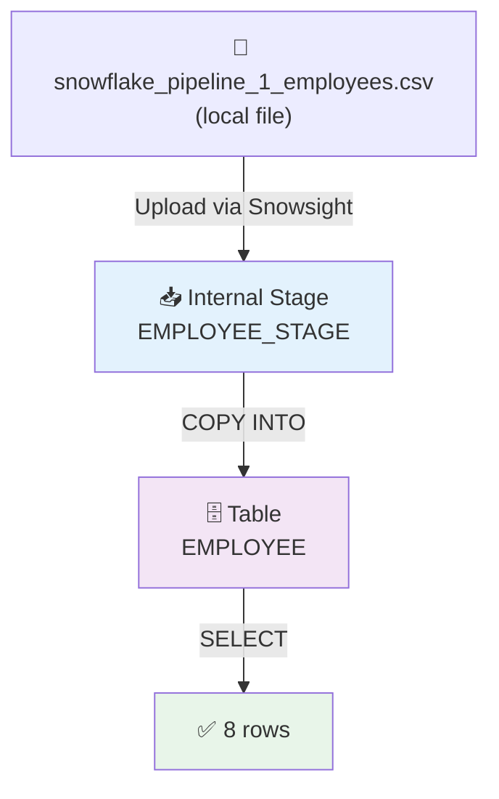

# 50) Snowflake — Basic CSV Batch Load Pipeline

## 📁 Files in This Folder

| File | What It Is |
| ---- | ---------- |
| [00) README.md](00%29%20README.md) | This explanation |
| [input file/snowflake_pipeline_1_employees.csv](input%20file/snowflake_pipeline_1_employees.csv) | The 8-row source CSV loaded into Snowflake |

This pipeline is **Snowflake only** — no AWS component, no Lambda, no IAM role.

## 🎯 Goal

Take one CSV from your laptop and land it in a real Snowflake table, using the standard internal-stage path:



## 🧱 The Objects We Create

| Object | Name | Why It Exists |
| ------ | ---- | ------------- |
| Database | `SNOWFLAKE_PRACTICE` | Top-level container for everything below |
| Schema | `EMPLOYEE_SCHEMA` | Groups this project's tables, stages and formats |
| Warehouse | `PRACTICE_WH` | The compute that actually runs the SQL and the load |
| Table | `EMPLOYEE` | Where the structured rows finally live |
| File Format | `EMPLOYEE_CSV_FORMAT` | Tells Snowflake how to read the CSV |
| Stage | `EMPLOYEE_STAGE` | Landing area for the file *inside* Snowflake |

Build order: **Database → Schema → Warehouse → Table → File Format → Stage → Upload → COPY INTO → Verify**

---

## Step 1 — Create the Database

```sql
CREATE DATABASE SNOWFLAKE_PRACTICE;

USE DATABASE SNOWFLAKE_PRACTICE;
```

---

## Step 2 — Create the Schema

```sql
CREATE SCHEMA EMPLOYEE_SCHEMA;

USE SCHEMA EMPLOYEE_SCHEMA;
```

The hierarchy so far:

```text
SNOWFLAKE_PRACTICE
└── EMPLOYEE_SCHEMA
```

---

## Step 3 — Create the Warehouse

The warehouse is the compute layer — without it nothing can execute. Skip this step if you already have one.

```sql
CREATE WAREHOUSE PRACTICE_WH
    WAREHOUSE_SIZE = XSMALL
    AUTO_SUSPEND = 60
    AUTO_RESUME = TRUE;

USE WAREHOUSE PRACTICE_WH;
```

| Property | Effect |
| -------- | ------ |
| `WAREHOUSE_SIZE = XSMALL` | Cheapest size — plenty for this exercise |
| `AUTO_SUSPEND = 60` | Sleeps after 60 seconds idle, so credits stop burning |
| `AUTO_RESUME = TRUE` | Wakes up automatically on the next query |

> 📌 The warehouse is **not** inside the database. It is a separate account-level object that runs queries against your data.

---

## Step 4 — Create the Table

The table has to match the CSV columns:

| CSV column | Table column | Data Type |
| ---------- | ------------ | --------- |
| `employee_id` | `EMPLOYEE_ID` | `NUMBER(10,0)` |
| `employee_name` | `EMPLOYEE_NAME` | `VARCHAR(100)` |
| `email` | `EMAIL` | `VARCHAR(200)` |
| `country` | `COUNTRY` | `VARCHAR(50)` |
| `joining_date` | `JOINING_DATE` | `DATE` |
| `salary` | `SALARY` | `NUMBER(12,2)` |

```sql
CREATE TABLE EMPLOYEE (
    EMPLOYEE_ID   NUMBER(10,0),
    EMPLOYEE_NAME VARCHAR(100),
    EMAIL         VARCHAR(200),
    COUNTRY       VARCHAR(50),
    JOINING_DATE  DATE,
    SALARY        NUMBER(12,2)
);
```

Check it:

```sql
DESC TABLE EMPLOYEE;
```

Expected output — six rows, one per column:

```text
EMPLOYEE_ID
EMPLOYEE_NAME
EMAIL
COUNTRY
JOINING_DATE
SALARY
```

---

## Step 5 — Create the File Format

The file format tells Snowflake how to parse the CSV, so the rules do not have to be repeated in every `COPY INTO`.

```sql
CREATE FILE FORMAT EMPLOYEE_CSV_FORMAT
    TYPE = CSV
    FIELD_DELIMITER = ','
    SKIP_HEADER = 1
    FIELD_OPTIONALLY_ENCLOSED_BY = '"'
    DATE_FORMAT = 'YYYY-MM-DD';
```

| Option | What It Means |
| ------ | ------------- |
| `TYPE = CSV` | The file is delimited text |
| `FIELD_DELIMITER = ','` | Columns are separated by commas |
| `SKIP_HEADER = 1` | Ignore the first line — `employee_id,employee_name,…` is a header, not data |
| `FIELD_OPTIONALLY_ENCLOSED_BY = '"'` | A field may be wrapped in double quotes, which matters when a value contains a comma |
| `DATE_FORMAT = 'YYYY-MM-DD'` | Read `2026-09-01` as a date |

Check it:

```sql
DESC FILE FORMAT EMPLOYEE_CSV_FORMAT;
```

---

## Step 6 — Create the Internal Stage

A stage is the landing area for files **inside** Snowflake. An internal stage keeps the data in Snowflake-managed storage, so nothing leaves the account.

```sql
CREATE STAGE EMPLOYEE_STAGE
    FILE_FORMAT = EMPLOYEE_CSV_FORMAT;
```

Check it:

```sql
SHOW STAGES;
```

The moving parts are now in place:

```text
EMPLOYEE_SCHEMA
│
├── EMPLOYEE_STAGE        ← the file lands here
├── EMPLOYEE_CSV_FORMAT   ← the rules for reading it
└── EMPLOYEE              ← the data lands here

PRACTICE_WH               ← account-level compute, outside the schema
```

> 📌 Setting `FILE_FORMAT` on the stage is only a default. `LIST @EMPLOYEE_STAGE` and `COPY INTO` will pick it up automatically, so you do not have to repeat it every time.

---

## Step 7 — Upload the CSV to the Stage

Source file: [input file/snowflake_pipeline_1_employees.csv](input%20file/snowflake_pipeline_1_employees.csv)

In Snowsight:

```text
Data → Databases → SNOWFLAKE_PRACTICE → EMPLOYEE_SCHEMA → Stages → EMPLOYEE_STAGE → Upload
```

Upload `snowflake_pipeline_1_employees.csv`, then confirm it arrived:

```sql
LIST @EMPLOYEE_STAGE;
```

You should see the file listed with its compressed size and hash. The `_staged` path shown alongside it is where the file physically sits on the Snowflake side.

---

## Step 8 — Load the CSV into the Table

This is the command the whole pipeline exists for:

```sql
COPY INTO EMPLOYEE
FROM @EMPLOYEE_STAGE
FILE_FORMAT = (FORMAT_NAME = 'EMPLOYEE_CSV_FORMAT');
```

Snowflake reads every file in the stage root and inserts the rows:

```text
@EMPLOYEE_STAGE (CSV)  →  COPY INTO  →  EMPLOYEE table
```

The command output tells you exactly what happened:

| Column | Meaning |
| ------ | ------- |
| `file` | Which staged file was read |
| `status` | `LOADED` on success |
| `rows_parsed` | Rows read from the file |
| `rows_loaded` | Rows actually inserted |
| `errors_seen` | Non-zero means some rows were rejected |

> ⚠️ `COPY INTO` is **not** a plain re-runnable insert. Snowflake remembers the files it already loaded for about 64 days, so running the exact same command again loads **0 rows**. To force a reload, add `FORCE = TRUE`, or load a file with a different name.

Useful variants:

```sql
-- parse the file and report errors without inserting anything
COPY INTO EMPLOYEE
FROM @EMPLOYEE_STAGE
VALIDATION_MODE = RETURN_ERRORS;

-- load, then delete the staged file in the same step
COPY INTO EMPLOYEE
FROM @EMPLOYEE_STAGE
FILE_FORMAT = (FORMAT_NAME = 'EMPLOYEE_CSV_FORMAT')
PURGE = TRUE;
```

---

## Step 9 — Verify the Load

```sql
SELECT * FROM EMPLOYEE;
```

You should get all 8 rows:

```text
EMPLOYEE_ID | EMPLOYEE_NAME | EMAIL                    | COUNTRY | JOINING_DATE | SALARY
------------+---------------+--------------------------+---------+--------------+-------
1001        | Rahul Sharma  | rahul.sharma@example.com | India   | 2026-09-01   | 75000
1002        | Priya Patil   | priya.patil@example.com  | India   | 2026-09-03   | 62000
1003        | Amit Verma    | amit.verma@example.com   | India   | 2026-09-05   | 58000
1004        | Sneha Joshi   | sneha.joshi@example.com  | India   | 2026-09-07   | 91000
1005        | Vikas Kumar   | vikas.kumar@example.com  | India   | 2026-09-10   | 67000
1006        | Neha Singh    | neha.singh@example.com   | India   | 2026-09-12   | 83000
1007        | Arjun Mehta   | arjun.mehta@example.com  | India   | 2026-09-15   | 54000
1008        | Pooja Desai   | pooja.desai@example.com  | India   | 2026-09-18   | 72000
```

Row count:

```sql
SELECT COUNT(*) FROM EMPLOYEE;
```

Expected:

```text
8
```

> 📌 If `COUNT(*)` returns `0`, the usual cause is that `COPY INTO` matched no files. Run `LIST @EMPLOYEE_STAGE` to check the file is really there.

---

## Step 10 — The Stage Still Holds the File

```sql
LIST @EMPLOYEE_STAGE;
```

The file is still there after a successful load. This is the behaviour worth remembering:

> **`COPY INTO` copies data from the stage into the table. It never deletes the staged file.**

That is what makes a stage a safe replay buffer — if the table is ever dropped, the source file is still available to load again. Add `PURGE = TRUE` to `COPY INTO` when you *do* want the file removed after loading.

---

## Step 11 — Check the Load History

Every `COPY INTO` is recorded, so you can prove what was loaded and when:

```sql
SELECT *
FROM TABLE(
    INFORMATION_SCHEMA.COPY_HISTORY(
        TABLE_NAME => 'SNOWFLAKE_PRACTICE.EMPLOYEE_SCHEMA.EMPLOYEE',
        START_TIME => DATEADD(DAY, -1, CURRENT_TIMESTAMP())
    )
);
```

The most useful columns are `FILE_NAME`, `STATUS`, `ROW_COUNT`, `ROW_PARSED` and `FIRST_ERROR_MESSAGE`.

> 📌 `COPY_HISTORY` only returns rows inside the time window you pass, so widen `START_TIME` (to `-7` or `-30` days) when the load was not today.

---

## 🧹 Cleanup

Stop paying for compute as soon as the practice is done:

```sql
ALTER WAREHOUSE PRACTICE_WH SUSPEND;
```

Or remove everything, in dependency order:

```sql
DROP TABLE IF EXISTS EMPLOYEE;
DROP STAGE IF EXISTS EMPLOYEE_STAGE;
DROP FILE FORMAT IF EXISTS EMPLOYEE_CSV_FORMAT;
DROP SCHEMA IF EXISTS EMPLOYEE_SCHEMA;
DROP WAREHOUSE IF EXISTS PRACTICE_WH;
DROP DATABASE IF EXISTS SNOWFLAKE_PRACTICE;
```

> ⚠️ `DROP SCHEMA` fails if the schema still contains objects unless you add `CASCADE` — hence dropping the table, stage and file format first, as above.

---

## ⚠️ Common Errors

| Error | Cause | Fix |
| ----- | ----- | --- |
| `Object does not exist` on `COPY INTO` | Session context is not set to the right database/schema | Re-run the `USE DATABASE` / `USE SCHEMA` lines |
| `No files were found` | Nothing uploaded, or the file went into a sub-folder of the stage | `LIST @EMPLOYEE_STAGE` to see the real path |
| `Number of columns in file does not match the table` | Table and CSV disagree | Compare against the table in Step 4 |
| Date parsing error | The CSV does not match the file format | Check `DATE_FORMAT = 'YYYY-MM-DD'` in Step 5 |
| `rows_loaded = 0` on a second run | Snowflake already loaded that file | Use `FORCE = TRUE`, or a new file name |
| `Insufficient privileges` | The role cannot act on the database/schema | Use a role with `USAGE`/`CREATE` rights, for example `ACCOUNTADMIN` |

When something looks wrong, this is the fastest way to find out why — it parses the file and reports errors **without** inserting anything:

```sql
COPY INTO EMPLOYEE
FROM @EMPLOYEE_STAGE
VALIDATION_MODE = RETURN_ERRORS;
```

---

## ⭐ What to Take Away

| Object | Role |
| ------ | ---- |
| **Database** | Container for your Snowflake objects |
| **Schema** | Organises tables, stages and formats inside a database |
| **Warehouse** | Compute that runs the SQL — the only part you pay for |
| **Table** | Where the structured data finally lives |
| **File Format** | Reusable parsing rules for the CSV |
| **Stage** | Landing area for files inside Snowflake |
| **COPY INTO** | Moves staged file data into the table |

The mental model to keep:

```text
Warehouse  = compute
Database   = container
Schema     = folder
Stage      = inbox
Table      = destination
COPY INTO  = the loader that connects the last two
```

The follow-up is [51) Snowflake — Multi-File CSV Batch Load Pipeline](../51%29%20Snowflake%20Multi-File%20CSV%20Batch%20Load%20Pipeline/00%29%20README.md), which loads five CSVs through this exact same setup.
