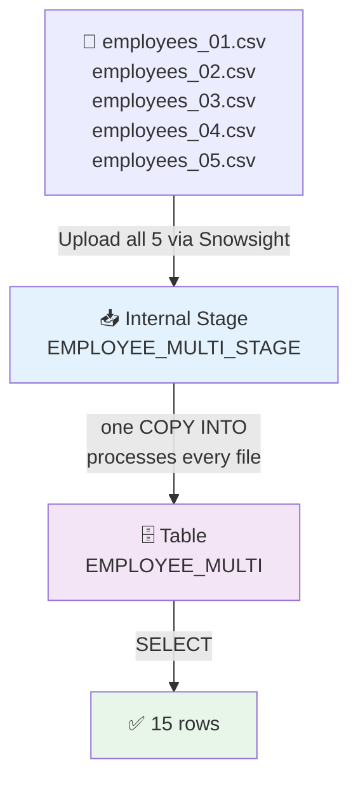

# 51) Snowflake — Multi-File CSV Batch Load Pipeline

## 📁 Files in This Folder

| File | What It Is |
| ---- | ---------- |
| [00) README.md](00%29%20README.md) | This explanation |
| [input file/](input%20file/) | Five CSVs — `employees_01.csv` … `employees_05.csv` |

This pipeline is **Snowflake only** — no AWS component. It is the multi-file follow-up to [50) Snowflake — Basic CSV Batch Load Pipeline](../50%29%20Snowflake%20Basic%20CSV%20Batch%20Load%20Pipeline/00%29%20README.md).

## 🎯 Goal

Pipeline 50 loaded **one** CSV. Here the same stage holds **five** CSVs and a **single** `COPY INTO` loads all of them — 15 rows in one statement.

## 📦 The Input Files

Five files × 3 employees = **15 records**:

```text
employees_01.csv   →   2001–2003
employees_02.csv   →   2004–2006
employees_03.csv   →   2007–2009
employees_04.csv   →   2010–2012
employees_05.csv   →   2013–2015
```

Every file shares the same header and layout:

```text
employee_id, employee_name, email, country, department, joining_date, salary
```

The only difference from Pipeline 50 is the extra `department` column and the number of files.

> 📌 We build a **completely new** environment (database, schema, warehouse, table, format, stage) instead of reusing Pipeline 50's objects — so the full setup is practised a second time and the two pipelines never interfere.

## 🧱 The Objects We Create

| Object | Name | Why It Exists |
| ------ | ---- | ------------- |
| Database | `SNOWFLAKE_MULTI_FILE_PRACTICE` | Top-level container |
| Schema | `MULTI_FILE_SCHEMA` | Groups this pipeline's objects |
| Warehouse | `MULTI_FILE_WH` | The compute that runs the load |
| Table | `EMPLOYEE_MULTI` | Where all 15 rows land |
| File Format | `EMPLOYEE_MULTI_CSV_FORMAT` | How to parse the CSVs |
| Stage | `EMPLOYEE_MULTI_STAGE` | Holds all five files at once |

Build order: **Database → Schema → Warehouse → Table → File Format → Stage → Upload ×5 → COPY INTO → Verify**



---

## Step 1 — Create the Database

```sql
CREATE DATABASE SNOWFLAKE_MULTI_FILE_PRACTICE;

USE DATABASE SNOWFLAKE_MULTI_FILE_PRACTICE;
```

---

## Step 2 — Create the Schema

```sql
CREATE SCHEMA MULTI_FILE_SCHEMA;

USE SCHEMA MULTI_FILE_SCHEMA;
```

The hierarchy so far:

```text
SNOWFLAKE_MULTI_FILE_PRACTICE
└── MULTI_FILE_SCHEMA
```

---

## Step 3 — Create the Warehouse

```sql
CREATE WAREHOUSE MULTI_FILE_WH
    WAREHOUSE_SIZE = XSMALL
    AUTO_SUSPEND = 60
    AUTO_RESUME = TRUE;

USE WAREHOUSE MULTI_FILE_WH;
```

> 📌 A warehouse is an account-level object, not part of the database. One warehouse can serve many pipelines — this exercise creates its own only so the setup is practised completely.

---

## Step 4 — Create the Table

Note the extra `DEPARTMENT` column compared with Pipeline 50:

| CSV column | Table column | Data Type |
| ---------- | ------------ | --------- |
| `employee_id` | `EMPLOYEE_ID` | `NUMBER(10,0)` |
| `employee_name` | `EMPLOYEE_NAME` | `VARCHAR(100)` |
| `email` | `EMAIL` | `VARCHAR(200)` |
| `country` | `COUNTRY` | `VARCHAR(50)` |
| `department` | `DEPARTMENT` | `VARCHAR(50)` |
| `joining_date` | `JOINING_DATE` | `DATE` |
| `salary` | `SALARY` | `NUMBER(12,2)` |

```sql
CREATE TABLE EMPLOYEE_MULTI (
    EMPLOYEE_ID   NUMBER(10,0),
    EMPLOYEE_NAME VARCHAR(100),
    EMAIL         VARCHAR(200),
    COUNTRY       VARCHAR(50),
    DEPARTMENT    VARCHAR(50),
    JOINING_DATE  DATE,
    SALARY        NUMBER(12,2)
);
```

Check it:

```sql
DESC TABLE EMPLOYEE_MULTI;
```

---

## Step 5 — Create the File Format

One file format serves all five files, because they all share the same layout and header:

```sql
CREATE FILE FORMAT EMPLOYEE_MULTI_CSV_FORMAT
    TYPE = CSV
    FIELD_DELIMITER = ','
    SKIP_HEADER = 1
    FIELD_OPTIONALLY_ENCLOSED_BY = '"'
    DATE_FORMAT = 'YYYY-MM-DD';
```

Check it:

```sql
DESC FILE FORMAT EMPLOYEE_MULTI_CSV_FORMAT;
```

> 📌 `SKIP_HEADER = 1` matters more here than in Pipeline 50 — every one of the five files has a header row, and Snowflake skips it in **each** file. That is why the result is 15 rows, not 20.

---

## Step 6 — Create the Internal Stage

```sql
CREATE STAGE EMPLOYEE_MULTI_STAGE
    FILE_FORMAT = EMPLOYEE_MULTI_CSV_FORMAT;
```

Check it:

```sql
SHOW STAGES;
```

The layout inside the schema:

```text
MULTI_FILE_SCHEMA
│
├── EMPLOYEE_MULTI_STAGE        ← all 5 files land here
├── EMPLOYEE_MULTI_CSV_FORMAT   ← the rules for reading them
└── EMPLOYEE_MULTI              ← all 15 rows land here

MULTI_FILE_WH                   ← account-level compute
```

---

## Step 7 — Upload All 5 CSV Files

Source folder: [input file/](input%20file/)

In Snowsight:

```text
Data → Databases → SNOWFLAKE_MULTI_FILE_PRACTICE → MULTI_FILE_SCHEMA → Stages → EMPLOYEE_MULTI_STAGE → Upload
```

Upload **all five** files: `employees_01.csv` … `employees_05.csv`.

> ⚠️ Upload them into the stage **root**. If they land in a sub-folder such as `employees/`, the plain `COPY INTO` in Step 9 will not find them — you would need `FROM @EMPLOYEE_MULTI_STAGE/employees/` instead.

---

## Step 8 — Verify All 5 Files

```sql
LIST @EMPLOYEE_MULTI_STAGE;
```

You should see five entries:

```text
employees_01.csv
employees_02.csv
employees_03.csv
employees_04.csv
employees_05.csv
```

The stage is now a **queue of files** instead of a single file — that is the whole difference from Pipeline 50:

```text
Pipeline 50                       Pipeline 51
───────────                       ───────────
   1 file                            5 files
     ↓                                 ↓
   Stage                             Stage
     ↓                                 ↓
 COPY INTO                         COPY INTO   ← still one call
     ↓                                 ↓
  8 rows                            15 rows
```

---

## Step 9 — Load All 5 Files

Now run:

```sql
COPY INTO EMPLOYEE_MULTI
FROM @EMPLOYEE_MULTI_STAGE
FILE_FORMAT = (
    FORMAT_NAME = 'EMPLOYEE_MULTI_CSV_FORMAT'
);
```

Snowflake will find the CSV files in the stage and load them into the table.

---

## Step 10 — Verify the Data

```sql
SELECT * FROM EMPLOYEE_MULTI ORDER BY EMPLOYEE_ID;
```

All 15 rows, exactly as they sit in the five input files:

```text
EMPLOYEE_ID | EMPLOYEE_NAME | EMAIL                     | COUNTRY | DEPARTMENT | JOINING_DATE | SALARY
------------+---------------+---------------------------+---------+------------+--------------+-------
2001        | Aarav Shah    | aarav.shah@example.com    | India   | IT         | 2026-09-01   | 70000
2002        | Isha Kulkarni | isha.kulkarni@example.com | India   | HR         | 2026-09-02   | 62000
2003        | Rohan Patil   | rohan.patil@example.com   | India   | Finance    | 2026-09-03   | 68000
2004        | Ananya Joshi  | ananya.joshi@example.com  | India   | IT         | 2026-09-04   | 82000
2005        | Vivek Singh   | vivek.singh@example.com   | India   | Sales      | 2026-09-05   | 59000
2006        | Meera Desai   | meera.desai@example.com   | India   | HR         | 2026-09-06   | 65000
2007        | Karan Mehta   | karan.mehta@example.com   | India   | Finance    | 2026-09-07   | 76000
2008        | Neha Verma    | neha.verma@example.com    | India   | IT         | 2026-09-08   | 88000
2009        | Aditya Rao    | aditya.rao@example.com    | India   | Sales      | 2026-09-09   | 61000
2010        | Sneha Nair    | sneha.nair@example.com    | India   | HR         | 2026-09-10   | 67000
2011        | Manish Gupta  | manish.gupta@example.com  | India   | IT         | 2026-09-11   | 91000
2012        | Pooja Patil   | pooja.patil@example.com   | India   | Finance    | 2026-09-12   | 73000
2013        | Rahul More    | rahul.more@example.com    | India   | Sales      | 2026-09-13   | 64000
2014        | Priya Shah    | priya.shah@example.com    | India   | IT         | 2026-09-14   | 85000
2015        | Sagar Joshi   | sagar.joshi@example.com   | India   | Finance    | 2026-09-15   | 79000
```

Row count:

```sql
SELECT COUNT(*) FROM EMPLOYEE_MULTI;
```

Expected:

```text
15
```

> 📌 `15 = 5 files × 3 rows`, not `20`. That is the proof that `SKIP_HEADER = 1` was applied to **every** file and not just the first one.

---

## Step 11 — Which File Did Each Row Come From?

Every loaded row keeps the metadata of the file it came from. This is the most useful trick when debugging a multi-file load:

```sql
SELECT
    METADATA$FILENAME        AS SOURCE_FILE,
    METADATA$FILE_ROW_NUMBER AS ROW_IN_FILE,
    EMPLOYEE_ID,
    EMPLOYEE_NAME
FROM EMPLOYEE_MULTI
ORDER BY SOURCE_FILE, EMPLOYEE_ID;
```

That gives a direct file → row mapping:

```text
SOURCE_FILE        | EMPLOYEE_ID | EMPLOYEE_NAME
-------------------+-------------+--------------
employees_01.csv   | 2001        | Aarav Shah
employees_01.csv   | 2002        | Isha Kulkarni
employees_01.csv   | 2003        | Rohan Patil
employees_02.csv   | 2004        | Ananya Joshi
employees_02.csv   | 2005        | Vivek Singh
employees_02.csv   | 2006        | Meera Desai
...
```

You can read the same metadata straight off the stage, before any load at all:

```sql
SELECT METADATA$FILENAME, METADATA$FILE_ROW_NUMBER
FROM @EMPLOYEE_MULTI_STAGE;
```

| Metadata column | Gives you |
| --------------- | --------- |
| `METADATA$FILENAME` | Full path of the staged file the row belongs to |
| `METADATA$FILE_ROW_NUMBER` | The row's position inside that file |
| `METADATA$FILE_LAST_MODIFIED` | When that file was last modified |
| `METADATA$FILE_CONTENT_KEY` | Checksum of that file |

> 📌 `FILE_ROW_NUMBER` is the row's position in the source file, and the header still occupies a line — so do not assume the first data row is `1`. Read the value instead of hard-coding an offset.

---

## Step 12 — Check the COPY History

```sql
SELECT
    FILE_NAME,
    STATUS,
    ROW_COUNT,
    ROW_PARSED,
    FIRST_ERROR_MESSAGE
FROM TABLE(
    INFORMATION_SCHEMA.COPY_HISTORY(
        TABLE_NAME => 'SNOWFLAKE_MULTI_FILE_PRACTICE.MULTI_FILE_SCHEMA.EMPLOYEE_MULTI',
        START_TIME => DATEADD(HOUR, -1, CURRENT_TIMESTAMP())
    )
)
ORDER BY LAST_LOAD_TIME;
```

You should see **five rows** — one per file, each with `STATUS = LOADED` and `ROW_COUNT = 3`. That is the proof a single `COPY INTO` really did process all five files.

> 📌 `COPY_HISTORY` only returns rows inside the time window you pass, so widen `START_TIME` (to `-7` or `-30` days) when the load was not within the last hour.

---

## 🧹 Cleanup

```sql
ALTER WAREHOUSE MULTI_FILE_WH SUSPEND;
```

Or remove everything, in dependency order:

```sql
DROP TABLE IF EXISTS EMPLOYEE_MULTI;
DROP STAGE IF EXISTS EMPLOYEE_MULTI_STAGE;
DROP FILE FORMAT IF EXISTS EMPLOYEE_MULTI_CSV_FORMAT;
DROP SCHEMA IF EXISTS MULTI_FILE_SCHEMA;
DROP WAREHOUSE IF EXISTS MULTI_FILE_WH;
DROP DATABASE IF EXISTS SNOWFLAKE_MULTI_FILE_PRACTICE;
```

> ⚠️ `DROP SCHEMA` fails if the schema still holds objects unless you add `CASCADE` — hence dropping the table, stage and file format first, as above.

---

## ⚠️ Common Errors

| Error | Cause | Fix |
| ----- | ----- | --- |
| `rows_loaded = 0` | `COPY INTO` matched no files — usually they were uploaded into a sub-folder | `LIST @EMPLOYEE_MULTI_STAGE` and fix the upload location or the stage path |
| Only 3 of 5 files loaded | The remaining files were uploaded after the `COPY INTO` ran | Just re-run `COPY INTO` — new files are loaded, old ones skipped |
| `COUNT(*)` = 20 instead of 15 | `SKIP_HEADER = 1` missing from the file format | Add it and reload with `FORCE = TRUE` |
| Load aborts because of one bad row | Default `ON_ERROR = 'ABORT_STATEMENT'` | Use `VALIDATION_MODE = RETURN_ERRORS` to locate the row, or `ON_ERROR = 'CONTINUE'` to skip it |
| `Number of columns in file does not match the table` | A file has a different layout — the extra `department` column is the usual suspect | Compare against the table in Step 4 |
| Second run loads nothing | Snowflake already loaded those exact files | `FORCE = TRUE`, or upload renamed files |

---

## ⭐ What to Take Away

| Concept | Point |
| ------- | ----- |
| **One stage, many files** | A stage is a folder — `COPY INTO` processes every file inside it |
| **One `COPY INTO`, many files** | No loop needed; Snowflake fans out over the stage for you |
| **One file format for all** | Safe only because the files share the same layout and header |
| **`SKIP_HEADER = 1`** | Applies per file, which is why the count stays at 15 |
| **Load metadata** | Snowflake remembers loaded files, so re-runs skip them instead of duplicating data |
| **`METADATA$FILENAME`** | Tells you exactly which file every row came from |
| **`COPY_HISTORY`** | Audits what was loaded, when, and whether any rows failed |

The two pipelines side by side:

```text
Pipeline 50                        Pipeline 51
───────────                        ───────────
1 file  → stage                    5 files → stage
        → COPY INTO                        → COPY INTO
        → 8 rows                           → 15 rows
```

The next step after this is automating the file arriving in the stage, instead of uploading it by hand — for example an external stage pointing at S3.
